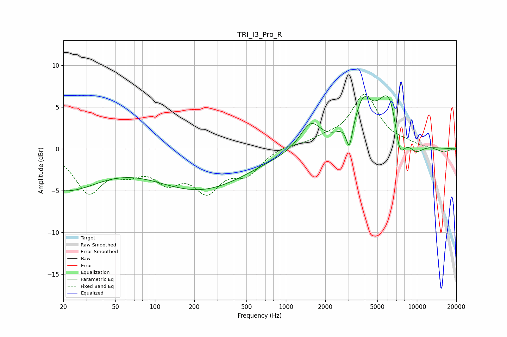

# TRI_I3_Pro_R
See [usage instructions](https://github.com/jaakkopasanen/AutoEq#usage) for more options and info.

### Parametric EQs
Apply preamp of -6.5 dB when using parametric equalizer.

|   # | Type    |   Fc (Hz) |    Q |   Gain (dB) |
|-----|---------|-----------|------|-------------|
|   1 | Peaking |        20 | 0.51 |        -4.7 |
|   2 | Peaking |       222 | 0.38 |        -4.7 |
|   3 | Peaking |      1546 | 1.79 |         3.2 |
|   4 | Peaking |      2771 | 2.12 |         0.9 |
|   5 | Peaking |      3050 | 5.99 |        -3.2 |
|   6 | Peaking |      3902 | 2.28 |         4.2 |
|   7 | Peaking |      6052 | 1.44 |         5.8 |
|   8 | Peaking |      6501 | 2.46 |         1.5 |
|   9 | Peaking |      7363 | 3.12 |        -4.7 |
|  10 | Peaking |      9805 | 2.16 |        -1.3 |

### Fixed Band EQs
When using fixed band (also called graphic) equalizer, apply preamp of **-6.6 dB** (if available) and set gains manually with these parameters.

|   # | Type    |   Fc (Hz) |    Q |   Gain (dB) |
|-----|---------|-----------|------|-------------|
|   1 | Peaking |        31 | 1.41 |        -4.9 |
|   2 | Peaking |        62 | 1.41 |        -2   |
|   3 | Peaking |       125 | 1.41 |        -3.2 |
|   4 | Peaking |       250 | 1.41 |        -4.4 |
|   5 | Peaking |       500 | 1.41 |        -2.6 |
|   6 | Peaking |      1000 | 1.41 |         0.5 |
|   7 | Peaking |      2000 | 1.41 |         0.9 |
|   8 | Peaking |      4000 | 1.41 |         6.3 |
|   9 | Peaking |      8000 | 1.41 |         0.4 |
|  10 | Peaking |     16000 | 1.41 |        -0.4 |

### Graphs

