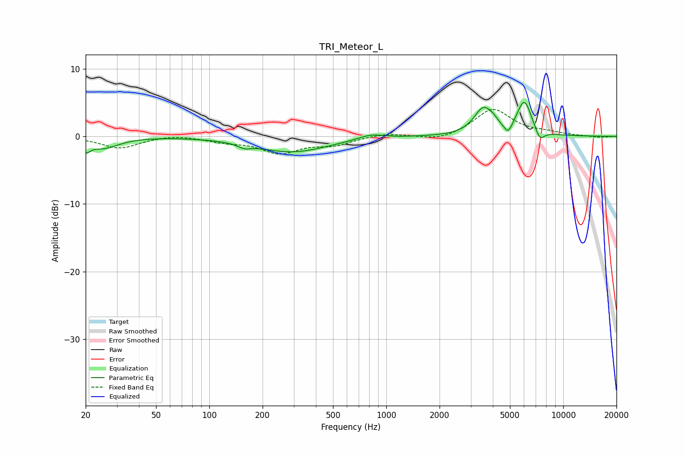

# TRI_Meteor_L
See [usage instructions](https://github.com/jaakkopasanen/AutoEq#usage) for more options and info.

### Parametric EQs
Apply preamp of -5.1 dB when using parametric equalizer.

|   # | Type    |   Fc (Hz) |    Q |   Gain (dB) |
|-----|---------|-----------|------|-------------|
|   1 | Peaking |        20 | 5.71 |        -1.4 |
|   2 | Peaking |        25 | 1.65 |        -1.6 |
|   3 | Peaking |       158 | 3.99 |        -0.6 |
|   4 | Peaking |       293 | 0.69 |        -2.3 |
|   5 | Peaking |       817 | 1.96 |         0.7 |
|   6 | Peaking |      3537 | 2.66 |         3.9 |
|   7 | Peaking |      4017 | 5.29 |         0.6 |
|   8 | Peaking |      4891 | 6    |        -1.5 |
|   9 | Peaking |      6027 | 3.25 |         5.1 |
|  10 | Peaking |      7369 | 4.91 |        -1.7 |

### Fixed Band EQs
When using fixed band (also called graphic) equalizer, apply preamp of **-4.1 dB** (if available) and set gains manually with these parameters.

|   # | Type    |   Fc (Hz) |    Q |   Gain (dB) |
|-----|---------|-----------|------|-------------|
|   1 | Peaking |        31 | 1.41 |        -1.7 |
|   2 | Peaking |        62 | 1.41 |         0.3 |
|   3 | Peaking |       125 | 1.41 |        -0.7 |
|   4 | Peaking |       250 | 1.41 |        -2.3 |
|   5 | Peaking |       500 | 1.41 |        -1.1 |
|   6 | Peaking |      1000 | 1.41 |         0.5 |
|   7 | Peaking |      2000 | 1.41 |        -0.7 |
|   8 | Peaking |      4000 | 1.41 |         4   |
|   9 | Peaking |      8000 | 1.41 |         0.4 |
|  10 | Peaking |     16000 | 1.41 |        -0.2 |

### Graphs

