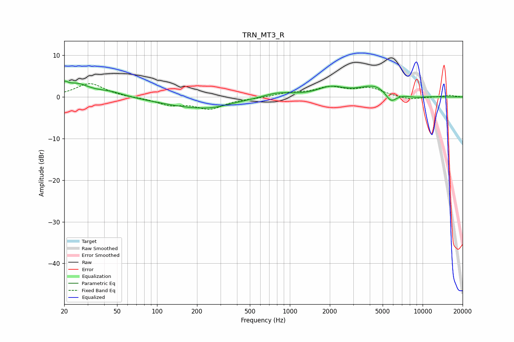

# TRN_MT3_R
See [usage instructions](https://github.com/jaakkopasanen/AutoEq#usage) for more options and info.

### Parametric EQs
Apply preamp of -3.9 dB when using parametric equalizer.

|   # | Type    |   Fc (Hz) |    Q |   Gain (dB) |
|-----|---------|-----------|------|-------------|
|   1 | Peaking |        20 | 5.63 |         1.6 |
|   2 | Peaking |        25 | 1.5  |         2.9 |
|   3 | Peaking |        44 | 1.36 |         1.1 |
|   4 | Peaking |       200 | 0.55 |        -2.6 |
|   5 | Peaking |       267 | 1.64 |        -0.3 |
|   6 | Peaking |       806 | 1.29 |         1.2 |
|   7 | Peaking |      2034 | 1.42 |         2.1 |
|   8 | Peaking |      4403 | 1.2  |         2.7 |
|   9 | Peaking |      5773 | 3.16 |        -2.6 |
|  10 | Peaking |      8808 | 1.87 |        -0.4 |

### Fixed Band EQs
When using fixed band (also called graphic) equalizer, apply preamp of **-3.3 dB** (if available) and set gains manually with these parameters.

|   # | Type    |   Fc (Hz) |    Q |   Gain (dB) |
|-----|---------|-----------|------|-------------|
|   1 | Peaking |        31 | 1.41 |         3.3 |
|   2 | Peaking |        62 | 1.41 |        -0.1 |
|   3 | Peaking |       125 | 1.41 |        -1.7 |
|   4 | Peaking |       250 | 1.41 |        -2.7 |
|   5 | Peaking |       500 | 1.41 |        -0.3 |
|   6 | Peaking |      1000 | 1.41 |         0.9 |
|   7 | Peaking |      2000 | 1.41 |         2.1 |
|   8 | Peaking |      4000 | 1.41 |         2   |
|   9 | Peaking |      8000 | 1.41 |        -0.7 |
|  10 | Peaking |     16000 | 1.41 |         0.4 |

### Graphs

