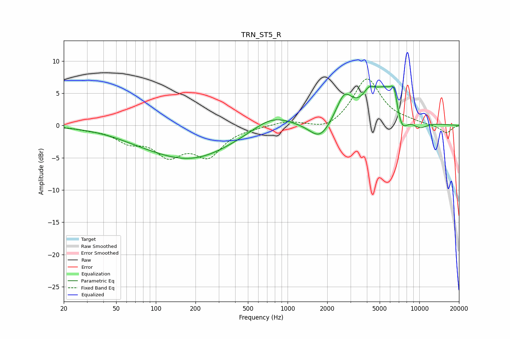

# TRN_ST5_R
See [usage instructions](https://github.com/jaakkopasanen/AutoEq#usage) for more options and info.

### Parametric EQs
Apply preamp of -6.2 dB when using parametric equalizer.

|   # | Type    |   Fc (Hz) |    Q |   Gain (dB) |
|-----|---------|-----------|------|-------------|
|   1 | Peaking |        73 | 0.69 |        -0.6 |
|   2 | Peaking |       185 | 0.44 |        -5   |
|   3 | Peaking |       762 | 0.96 |         2.2 |
|   4 | Peaking |      1763 | 1.76 |        -2.8 |
|   5 | Peaking |      2690 | 2.34 |         3.9 |
|   6 | Peaking |      4151 | 3.35 |         1.8 |
|   7 | Peaking |      5766 | 1.03 |         6.4 |
|   8 | Peaking |      6447 | 5.11 |         2.9 |
|   9 | Peaking |      7274 | 2.51 |        -4.9 |
|  10 | Peaking |     10000 | 1.85 |        -1.6 |

### Fixed Band EQs
When using fixed band (also called graphic) equalizer, apply preamp of **-7.3 dB** (if available) and set gains manually with these parameters.

|   # | Type    |   Fc (Hz) |    Q |   Gain (dB) |
|-----|---------|-----------|------|-------------|
|   1 | Peaking |        31 | 1.41 |        -0.4 |
|   2 | Peaking |        62 | 1.41 |        -2.1 |
|   3 | Peaking |       125 | 1.41 |        -4.1 |
|   4 | Peaking |       250 | 1.41 |        -4.3 |
|   5 | Peaking |       500 | 1.41 |        -0.2 |
|   6 | Peaking |      1000 | 1.41 |         0.7 |
|   7 | Peaking |      2000 | 1.41 |        -1   |
|   8 | Peaking |      4000 | 1.41 |         7.3 |
|   9 | Peaking |      8000 | 1.41 |         0.4 |
|  10 | Peaking |     16000 | 1.41 |        -1.2 |

### Graphs

