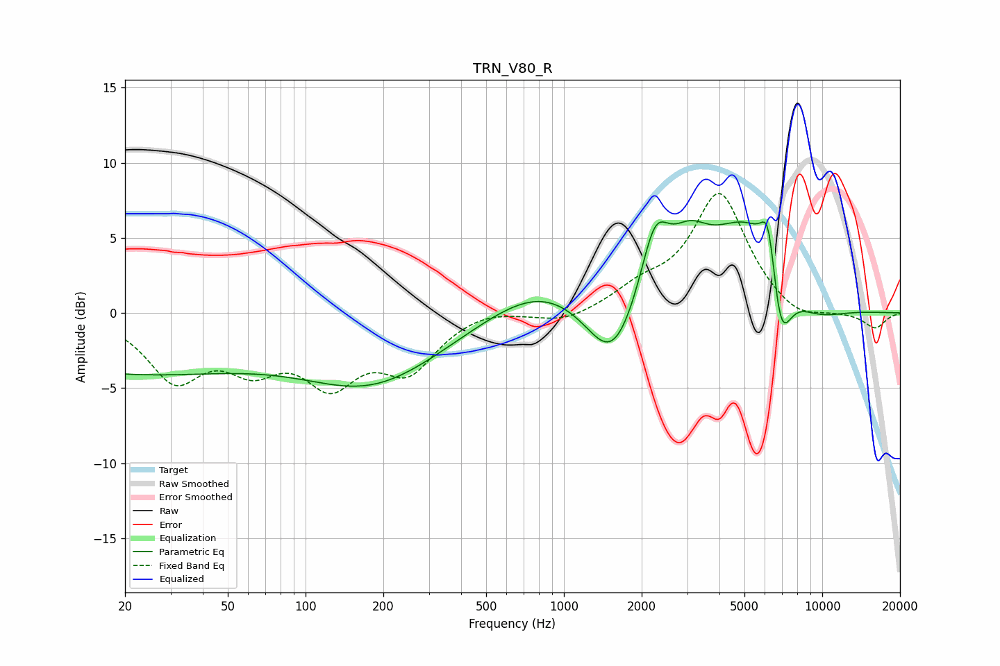

# TRN_V80_R
See [usage instructions](https://github.com/jaakkopasanen/AutoEq#usage) for more options and info.

### Parametric EQs
Apply preamp of -6.3 dB when using parametric equalizer.

|   # | Type    |   Fc (Hz) |    Q |   Gain (dB) |
|-----|---------|-----------|------|-------------|
|   1 | Peaking |        20 | 0.27 |        -3.9 |
|   2 | Peaking |       182 | 0.51 |        -4.4 |
|   3 | Peaking |       819 | 0.69 |         2.2 |
|   4 | Peaking |      1544 | 1.4  |        -4.7 |
|   5 | Peaking |      2251 | 2.48 |         4.8 |
|   6 | Peaking |      3059 | 1.86 |         2.6 |
|   7 | Peaking |      5270 | 0.86 |         6.4 |
|   8 | Peaking |      6199 | 4.63 |         4.1 |
|   9 | Peaking |      6860 | 3.04 |        -5.8 |
|  10 | Peaking |      9037 | 1.01 |        -1.9 |

### Fixed Band EQs
When using fixed band (also called graphic) equalizer, apply preamp of **-8.1 dB** (if available) and set gains manually with these parameters.

|   # | Type    |   Fc (Hz) |    Q |   Gain (dB) |
|-----|---------|-----------|------|-------------|
|   1 | Peaking |        31 | 1.41 |        -4.1 |
|   2 | Peaking |        62 | 1.41 |        -2.9 |
|   3 | Peaking |       125 | 1.41 |        -4.1 |
|   4 | Peaking |       250 | 1.41 |        -3.5 |
|   5 | Peaking |       500 | 1.41 |         0.4 |
|   6 | Peaking |      1000 | 1.41 |        -0.7 |
|   7 | Peaking |      2000 | 1.41 |         1.3 |
|   8 | Peaking |      4000 | 1.41 |         7.9 |
|   9 | Peaking |      8000 | 1.41 |        -0.9 |
|  10 | Peaking |     16000 | 1.41 |        -1   |

### Graphs

