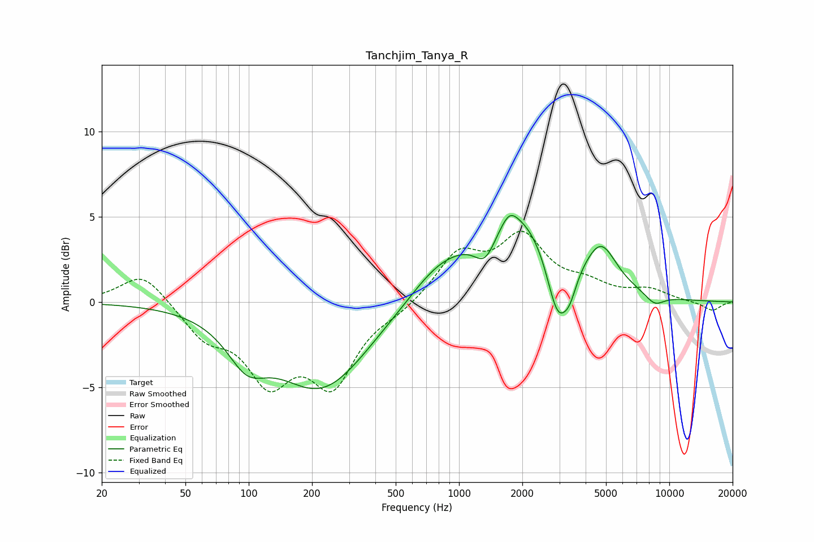

# Tanchjim_Tanya_R
See [usage instructions](https://github.com/jaakkopasanen/AutoEq#usage) for more options and info.

### Parametric EQs
Apply preamp of -5.2 dB when using parametric equalizer.

|   # | Type    |   Fc (Hz) |    Q |   Gain (dB) |
|-----|---------|-----------|------|-------------|
|   1 | Peaking |        98 | 1.53 |        -2.2 |
|   2 | Peaking |       222 | 0.64 |        -5.1 |
|   3 | Peaking |       789 | 1.01 |         1.4 |
|   4 | Peaking |      1335 | 2.66 |        -1.8 |
|   5 | Peaking |      1738 | 3.79 |         0.7 |
|   6 | Peaking |      1880 | 0.69 |         5.3 |
|   7 | Peaking |      2948 | 2.62 |        -4.1 |
|   8 | Peaking |      3372 | 4.22 |        -1.1 |
|   9 | Peaking |      4752 | 1.97 |         2.3 |
|  10 | Peaking |      8510 | 2.75 |        -0.7 |

### Fixed Band EQs
When using fixed band (also called graphic) equalizer, apply preamp of **-4.2 dB** (if available) and set gains manually with these parameters.

|   # | Type    |   Fc (Hz) |    Q |   Gain (dB) |
|-----|---------|-----------|------|-------------|
|   1 | Peaking |        31 | 1.41 |         1.8 |
|   2 | Peaking |        62 | 1.41 |        -1.8 |
|   3 | Peaking |       125 | 1.41 |        -4.2 |
|   4 | Peaking |       250 | 1.41 |        -4.5 |
|   5 | Peaking |       500 | 1.41 |        -0.5 |
|   6 | Peaking |      1000 | 1.41 |         2.7 |
|   7 | Peaking |      2000 | 1.41 |         3.6 |
|   8 | Peaking |      4000 | 1.41 |         0.8 |
|   9 | Peaking |      8000 | 1.41 |         0.6 |
|  10 | Peaking |     16000 | 1.41 |        -0.5 |

### Graphs

