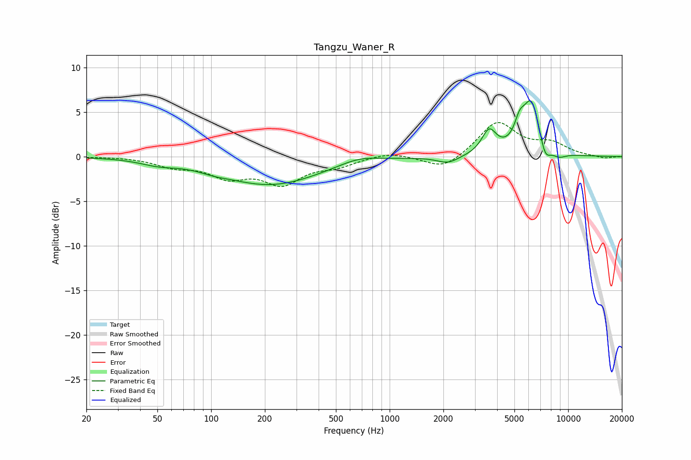

# Tangzu_Waner_R
See [usage instructions](https://github.com/jaakkopasanen/AutoEq#usage) for more options and info.

### Parametric EQs
Apply preamp of -6.4 dB when using parametric equalizer.

|   # | Type    |   Fc (Hz) |    Q |   Gain (dB) |
|-----|---------|-----------|------|-------------|
|   1 | Peaking |        50 | 1.47 |        -0.5 |
|   2 | Peaking |       103 | 1.94 |        -0.3 |
|   3 | Peaking |       215 | 0.51 |        -3.1 |
|   4 | Peaking |       671 | 1.29 |         0.7 |
|   5 | Peaking |      2123 | 2.31 |        -0.8 |
|   6 | Peaking |      3608 | 3.45 |         2.7 |
|   7 | Peaking |      5340 | 4.9  |         1.9 |
|   8 | Peaking |      6236 | 2.71 |         6.2 |
|   9 | Peaking |      7405 | 4.23 |        -2.2 |
|  10 | Peaking |      8881 | 3.17 |        -0.6 |

### Fixed Band EQs
When using fixed band (also called graphic) equalizer, apply preamp of **-3.9 dB** (if available) and set gains manually with these parameters.

|   # | Type    |   Fc (Hz) |    Q |   Gain (dB) |
|-----|---------|-----------|------|-------------|
|   1 | Peaking |        31 | 1.41 |         0   |
|   2 | Peaking |        62 | 1.41 |        -1   |
|   3 | Peaking |       125 | 1.41 |        -2   |
|   4 | Peaking |       250 | 1.41 |        -2.8 |
|   5 | Peaking |       500 | 1.41 |        -0.9 |
|   6 | Peaking |      1000 | 1.41 |         0.6 |
|   7 | Peaking |      2000 | 1.41 |        -1.5 |
|   8 | Peaking |      4000 | 1.41 |         3.9 |
|   9 | Peaking |      8000 | 1.41 |         1.3 |
|  10 | Peaking |     16000 | 1.41 |        -0.2 |

### Graphs

