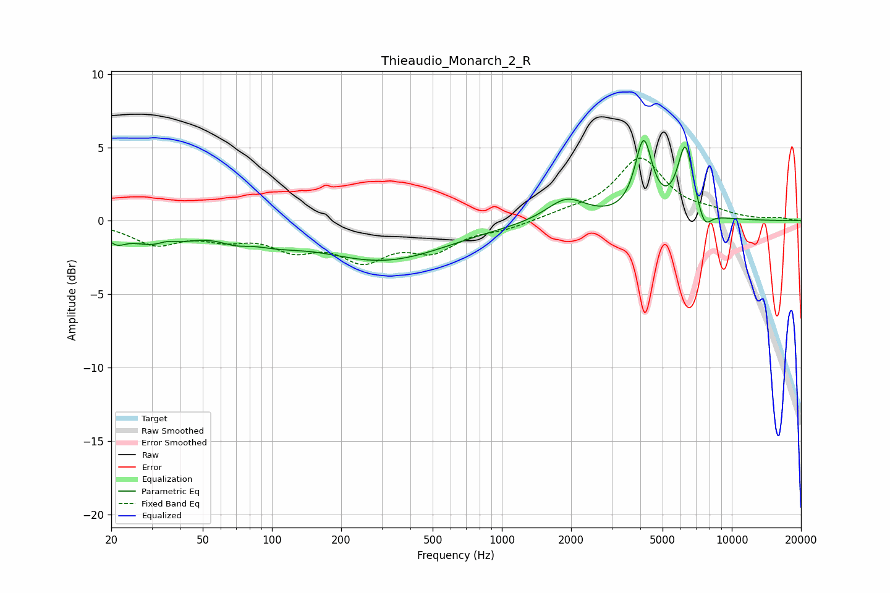

# Thieaudio_Monarch_2_R
See [usage instructions](https://github.com/jaakkopasanen/AutoEq#usage) for more options and info.

### Parametric EQs
Apply preamp of -5.6 dB when using parametric equalizer.

|   # | Type    |   Fc (Hz) |    Q |   Gain (dB) |
|-----|---------|-----------|------|-------------|
|   1 | Peaking |        21 | 3.72 |        -0.8 |
|   2 | Peaking |        32 | 1.06 |        -1.5 |
|   3 | Peaking |        35 | 3.65 |         0.3 |
|   4 | Peaking |        69 | 2.16 |        -0.5 |
|   5 | Peaking |       103 | 1.16 |        -0.7 |
|   6 | Peaking |       306 | 0.5  |        -2.6 |
|   7 | Peaking |      1908 | 1.63 |         1.6 |
|   8 | Peaking |      4135 | 3.81 |         5.1 |
|   9 | Peaking |      6287 | 3.97 |         4.9 |
|  10 | Peaking |      7599 | 4.5  |        -1.3 |

### Fixed Band EQs
When using fixed band (also called graphic) equalizer, apply preamp of **-4.4 dB** (if available) and set gains manually with these parameters.

|   # | Type    |   Fc (Hz) |    Q |   Gain (dB) |
|-----|---------|-----------|------|-------------|
|   1 | Peaking |        31 | 1.41 |        -1.5 |
|   2 | Peaking |        62 | 1.41 |        -0.9 |
|   3 | Peaking |       125 | 1.41 |        -1.6 |
|   4 | Peaking |       250 | 1.41 |        -2.3 |
|   5 | Peaking |       500 | 1.41 |        -1.8 |
|   6 | Peaking |      1000 | 1.41 |        -0.5 |
|   7 | Peaking |      2000 | 1.41 |         0.5 |
|   8 | Peaking |      4000 | 1.41 |         4.2 |
|   9 | Peaking |      8000 | 1.41 |         0.4 |
|  10 | Peaking |     16000 | 1.41 |         0.2 |

### Graphs

