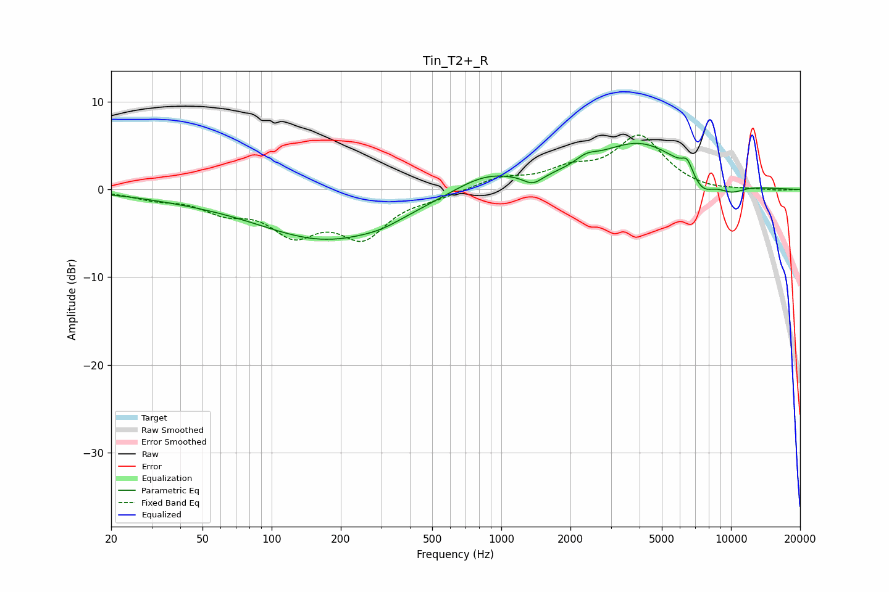

# Tin_T2+_R
See [usage instructions](https://github.com/jaakkopasanen/AutoEq#usage) for more options and info.

### Parametric EQs
Apply preamp of -5.4 dB when using parametric equalizer.

|   # | Type    |   Fc (Hz) |    Q |   Gain (dB) |
|-----|---------|-----------|------|-------------|
|   1 | Peaking |        40 | 0.61 |        -0.5 |
|   2 | Peaking |       175 | 0.46 |        -5.6 |
|   3 | Peaking |       301 | 1.64 |        -0.4 |
|   4 | Peaking |       851 | 0.97 |         2   |
|   5 | Peaking |      1371 | 3.4  |        -1.1 |
|   6 | Peaking |      2340 | 2.96 |         0.9 |
|   7 | Peaking |      3987 | 0.71 |         5.3 |
|   8 | Peaking |      6451 | 5.97 |         1.5 |
|   9 | Peaking |      7500 | 2.52 |        -2.1 |
|  10 | Peaking |     10000 | 2.01 |        -1.1 |

### Fixed Band EQs
When using fixed band (also called graphic) equalizer, apply preamp of **-6.3 dB** (if available) and set gains manually with these parameters.

|   # | Type    |   Fc (Hz) |    Q |   Gain (dB) |
|-----|---------|-----------|------|-------------|
|   1 | Peaking |        31 | 1.41 |        -0.8 |
|   2 | Peaking |        62 | 1.41 |        -2   |
|   3 | Peaking |       125 | 1.41 |        -4.4 |
|   4 | Peaking |       250 | 1.41 |        -4.9 |
|   5 | Peaking |       500 | 1.41 |        -0.6 |
|   6 | Peaking |      1000 | 1.41 |         1.2 |
|   7 | Peaking |      2000 | 1.41 |         1.9 |
|   8 | Peaking |      4000 | 1.41 |         5.9 |
|   9 | Peaking |      8000 | 1.41 |        -0.3 |
|  10 | Peaking |     16000 | 1.41 |        -0.1 |

### Graphs

