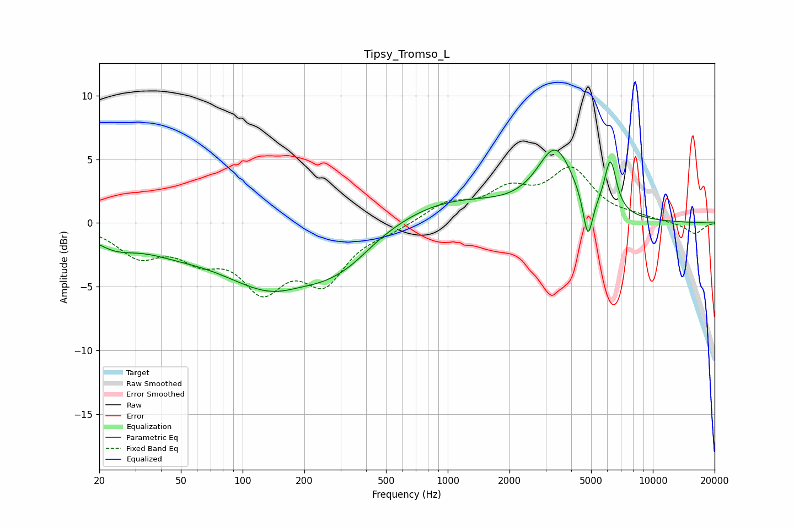

# Tipsy_Tromso_L
See [usage instructions](https://github.com/jaakkopasanen/AutoEq#usage) for more options and info.

### Parametric EQs
Apply preamp of -5.8 dB when using parametric equalizer.

|   # | Type    |   Fc (Hz) |    Q |   Gain (dB) |
|-----|---------|-----------|------|-------------|
|   1 | Peaking |        24 | 1.35 |        -1.2 |
|   2 | Peaking |        45 | 0.81 |        -1   |
|   3 | Peaking |       152 | 0.51 |        -5.3 |
|   4 | Peaking |       184 | 1.73 |         0.3 |
|   5 | Peaking |       269 | 1.24 |        -0.5 |
|   6 | Peaking |       340 | 1.24 |        -0.8 |
|   7 | Peaking |       996 | 0.51 |         1.9 |
|   8 | Peaking |      3349 | 1.56 |         5.3 |
|   9 | Peaking |      4823 | 5.98 |        -3.5 |
|  10 | Peaking |      6213 | 4.79 |         4   |

### Fixed Band EQs
When using fixed band (also called graphic) equalizer, apply preamp of **-4.5 dB** (if available) and set gains manually with these parameters.

|   # | Type    |   Fc (Hz) |    Q |   Gain (dB) |
|-----|---------|-----------|------|-------------|
|   1 | Peaking |        31 | 1.41 |        -2.3 |
|   2 | Peaking |        62 | 1.41 |        -2.2 |
|   3 | Peaking |       125 | 1.41 |        -4.6 |
|   4 | Peaking |       250 | 1.41 |        -4.2 |
|   5 | Peaking |       500 | 1.41 |        -0.5 |
|   6 | Peaking |      1000 | 1.41 |         1.4 |
|   7 | Peaking |      2000 | 1.41 |         2.2 |
|   8 | Peaking |      4000 | 1.41 |         3.9 |
|   9 | Peaking |      8000 | 1.41 |         0.3 |
|  10 | Peaking |     16000 | 1.41 |        -0.9 |

### Graphs

