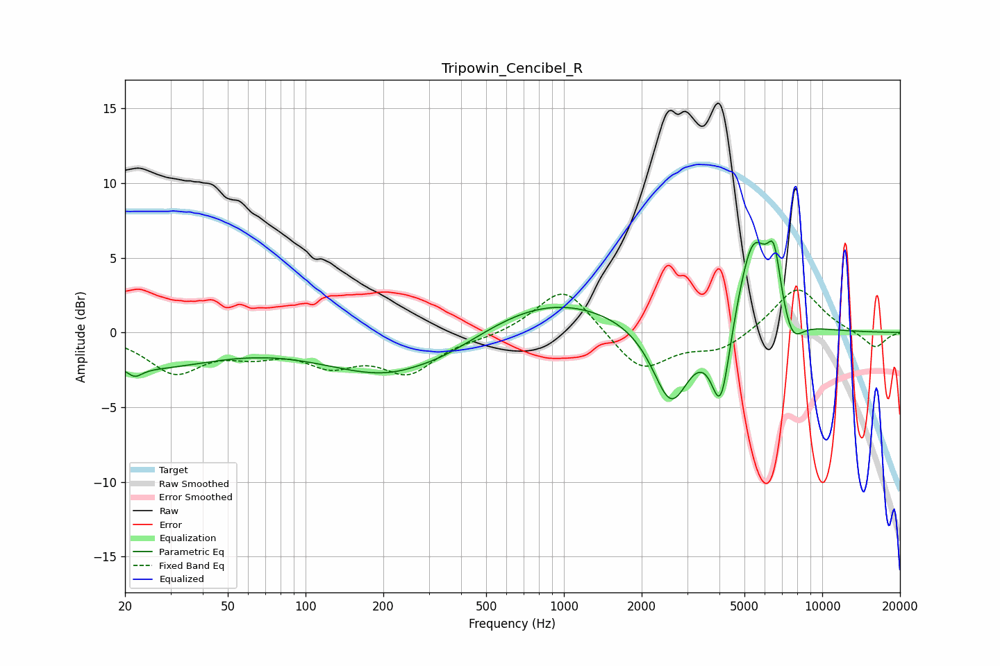

# Tripowin_Cencibel_R
See [usage instructions](https://github.com/jaakkopasanen/AutoEq#usage) for more options and info.

### Parametric EQs
Apply preamp of -6.2 dB when using parametric equalizer.

|   # | Type    |   Fc (Hz) |    Q |   Gain (dB) |
|-----|---------|-----------|------|-------------|
|   1 | Peaking |        22 | 5    |        -0.6 |
|   2 | Peaking |        23 | 0.5  |        -2.2 |
|   3 | Peaking |       246 | 0.49 |        -3.5 |
|   4 | Peaking |       270 | 1.78 |         0.2 |
|   5 | Peaking |       808 | 0.46 |         2.8 |
|   6 | Peaking |      2599 | 1.98 |        -5.3 |
|   7 | Peaking |      4050 | 3.73 |        -5.8 |
|   8 | Peaking |      5390 | 2.15 |         6.6 |
|   9 | Peaking |      6509 | 5.14 |         3.6 |
|  10 | Peaking |      7624 | 3.22 |        -1.9 |

### Fixed Band EQs
When using fixed band (also called graphic) equalizer, apply preamp of **-2.9 dB** (if available) and set gains manually with these parameters.

|   # | Type    |   Fc (Hz) |    Q |   Gain (dB) |
|-----|---------|-----------|------|-------------|
|   1 | Peaking |        31 | 1.41 |        -2.5 |
|   2 | Peaking |        62 | 1.41 |        -1.1 |
|   3 | Peaking |       125 | 1.41 |        -1.8 |
|   4 | Peaking |       250 | 1.41 |        -2.5 |
|   5 | Peaking |       500 | 1.41 |        -0.3 |
|   6 | Peaking |      1000 | 1.41 |         3.2 |
|   7 | Peaking |      2000 | 1.41 |        -2.6 |
|   8 | Peaking |      4000 | 1.41 |        -1.2 |
|   9 | Peaking |      8000 | 1.41 |         3.1 |
|  10 | Peaking |     16000 | 1.41 |        -1.1 |

### Graphs

