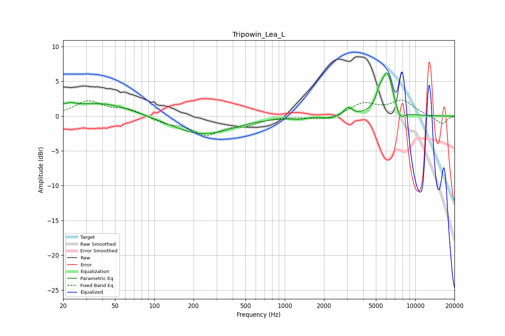

# Tripowin_Lea_L
See [usage instructions](https://github.com/jaakkopasanen/AutoEq#usage) for more options and info.

### Parametric EQs
Apply preamp of -6.3 dB when using parametric equalizer.

|   # | Type    |   Fc (Hz) |    Q |   Gain (dB) |
|-----|---------|-----------|------|-------------|
|   1 | Peaking |        20 | 2.32 |         1.7 |
|   2 | Peaking |        20 | 5.42 |        -0.8 |
|   3 | Peaking |        41 | 0.64 |         1.8 |
|   4 | Peaking |       234 | 0.62 |        -2.7 |
|   5 | Peaking |      1286 | 2.9  |        -0.3 |
|   6 | Peaking |      2248 | 3.03 |        -0.4 |
|   7 | Peaking |      3060 | 4.97 |         1.1 |
|   8 | Peaking |      5302 | 6    |         1.5 |
|   9 | Peaking |      6105 | 3.1  |         6.2 |
|  10 | Peaking |      7665 | 4.03 |        -1.6 |

### Fixed Band EQs
When using fixed band (also called graphic) equalizer, apply preamp of **-2.4 dB** (if available) and set gains manually with these parameters.

|   # | Type    |   Fc (Hz) |    Q |   Gain (dB) |
|-----|---------|-----------|------|-------------|
|   1 | Peaking |        31 | 1.41 |         2.1 |
|   2 | Peaking |        62 | 1.41 |         0.9 |
|   3 | Peaking |       125 | 1.41 |        -0.9 |
|   4 | Peaking |       250 | 1.41 |        -2.5 |
|   5 | Peaking |       500 | 1.41 |        -1.1 |
|   6 | Peaking |      1000 | 1.41 |         0   |
|   7 | Peaking |      2000 | 1.41 |        -0.7 |
|   8 | Peaking |      4000 | 1.41 |         1.8 |
|   9 | Peaking |      8000 | 1.41 |         2.1 |
|  10 | Peaking |     16000 | 1.41 |        -1.2 |

### Graphs

