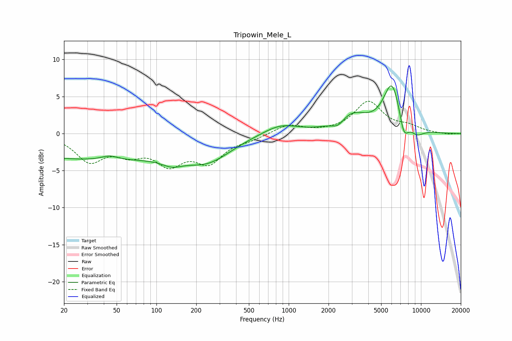

# Tripowin_Mele_L
See [usage instructions](https://github.com/jaakkopasanen/AutoEq#usage) for more options and info.

### Parametric EQs
Apply preamp of -6.5 dB when using parametric equalizer.

|   # | Type    |   Fc (Hz) |    Q |   Gain (dB) |
|-----|---------|-----------|------|-------------|
|   1 | Peaking |        34 | 0.18 |        -3.5 |
|   2 | Peaking |        44 | 2.35 |         0.6 |
|   3 | Peaking |       131 | 1.84 |        -0.9 |
|   4 | Peaking |       248 | 0.82 |        -2.7 |
|   5 | Peaking |       864 | 1.06 |         1.3 |
|   6 | Peaking |      2360 | 3.11 |        -0.9 |
|   7 | Peaking |      3021 | 1.24 |         2.4 |
|   8 | Peaking |      6042 | 2.09 |         6.6 |
|   9 | Peaking |      7422 | 3.92 |        -2.9 |
|  10 | Peaking |      9337 | 2.64 |        -0.9 |

### Fixed Band EQs
When using fixed band (also called graphic) equalizer, apply preamp of **-4.5 dB** (if available) and set gains manually with these parameters.

|   # | Type    |   Fc (Hz) |    Q |   Gain (dB) |
|-----|---------|-----------|------|-------------|
|   1 | Peaking |        31 | 1.41 |        -3.5 |
|   2 | Peaking |        62 | 1.41 |        -2.1 |
|   3 | Peaking |       125 | 1.41 |        -3.6 |
|   4 | Peaking |       250 | 1.41 |        -3.5 |
|   5 | Peaking |       500 | 1.41 |        -0.6 |
|   6 | Peaking |      1000 | 1.41 |         1.2 |
|   7 | Peaking |      2000 | 1.41 |         0.1 |
|   8 | Peaking |      4000 | 1.41 |         4.2 |
|   9 | Peaking |      8000 | 1.41 |         0.8 |
|  10 | Peaking |     16000 | 1.41 |        -0.1 |

### Graphs

