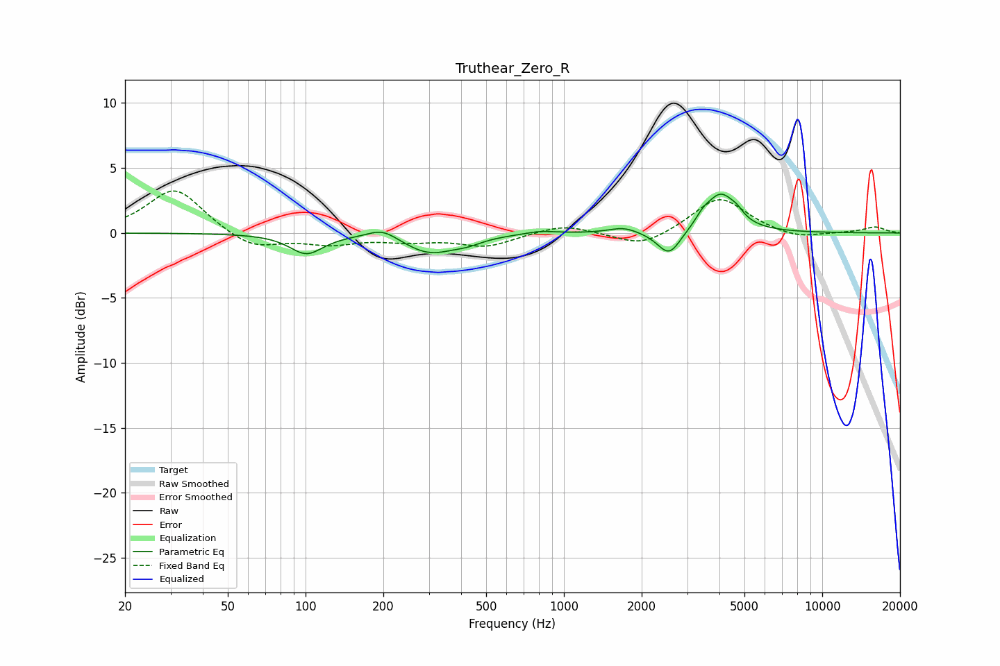

# Truthear_Zero_R
See [usage instructions](https://github.com/jaakkopasanen/AutoEq#usage) for more options and info.

### Parametric EQs
Apply preamp of -3.1 dB when using parametric equalizer.

|   # | Type    |   Fc (Hz) |    Q |   Gain (dB) |
|-----|---------|-----------|------|-------------|
|   1 | Peaking |       101 | 2.2  |        -1.5 |
|   2 | Peaking |       199 | 2.41 |         0.8 |
|   3 | Peaking |       302 | 1.38 |        -1.5 |
|   4 | Peaking |       425 | 2.54 |        -0.3 |
|   5 | Peaking |       811 | 2.42 |         0.2 |
|   6 | Peaking |      1701 | 2.59 |         0.4 |
|   7 | Peaking |      2556 | 3.14 |        -2   |
|   8 | Peaking |      3454 | 5.23 |         0.5 |
|   9 | Peaking |      4046 | 2.4  |         2.9 |
|  10 | Peaking |      4683 | 6    |         0.4 |

### Fixed Band EQs
When using fixed band (also called graphic) equalizer, apply preamp of **-3.3 dB** (if available) and set gains manually with these parameters.

|   # | Type    |   Fc (Hz) |    Q |   Gain (dB) |
|-----|---------|-----------|------|-------------|
|   1 | Peaking |        31 | 1.41 |         3.5 |
|   2 | Peaking |        62 | 1.41 |        -1.3 |
|   3 | Peaking |       125 | 1.41 |        -0.8 |
|   4 | Peaking |       250 | 1.41 |        -0.5 |
|   5 | Peaking |       500 | 1.41 |        -1   |
|   6 | Peaking |      1000 | 1.41 |         0.7 |
|   7 | Peaking |      2000 | 1.41 |        -1.1 |
|   8 | Peaking |      4000 | 1.41 |         2.8 |
|   9 | Peaking |      8000 | 1.41 |        -0.5 |
|  10 | Peaking |     16000 | 1.41 |         0.5 |

### Graphs

