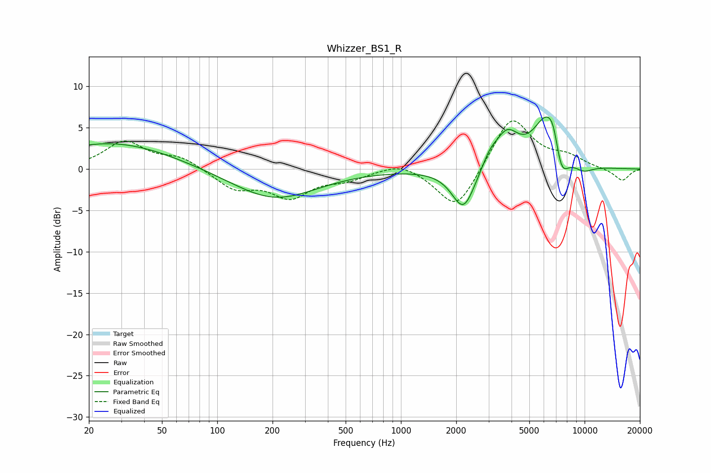

# Whizzer_BS1_R
See [usage instructions](https://github.com/jaakkopasanen/AutoEq#usage) for more options and info.

### Parametric EQs
Apply preamp of -6.4 dB when using parametric equalizer.

|   # | Type    |   Fc (Hz) |    Q |   Gain (dB) |
|-----|---------|-----------|------|-------------|
|   1 | Peaking |        27 | 0.43 |         3.2 |
|   2 | Peaking |       205 | 0.61 |        -3.7 |
|   3 | Peaking |      2192 | 2.22 |        -5.2 |
|   4 | Peaking |      3043 | 3.43 |         1.3 |
|   5 | Peaking |      3496 | 1.39 |         0.2 |
|   6 | Peaking |      3771 | 2.18 |         3.8 |
|   7 | Peaking |      6224 | 1.8  |         6.2 |
|   8 | Peaking |      6791 | 4.32 |         2.3 |
|   9 | Peaking |      7409 | 3.25 |        -4.4 |
|  10 | Peaking |      9834 | 2.32 |        -0.9 |

### Fixed Band EQs
When using fixed band (also called graphic) equalizer, apply preamp of **-5.9 dB** (if available) and set gains manually with these parameters.

|   # | Type    |   Fc (Hz) |    Q |   Gain (dB) |
|-----|---------|-----------|------|-------------|
|   1 | Peaking |        31 | 1.41 |         3.2 |
|   2 | Peaking |        62 | 1.41 |         1.4 |
|   3 | Peaking |       125 | 1.41 |        -2.3 |
|   4 | Peaking |       250 | 1.41 |        -3.2 |
|   5 | Peaking |       500 | 1.41 |        -1.1 |
|   6 | Peaking |      1000 | 1.41 |         1   |
|   7 | Peaking |      2000 | 1.41 |        -5.2 |
|   8 | Peaking |      4000 | 1.41 |         6.5 |
|   9 | Peaking |      8000 | 1.41 |         1.3 |
|  10 | Peaking |     16000 | 1.41 |        -1.5 |

### Graphs

