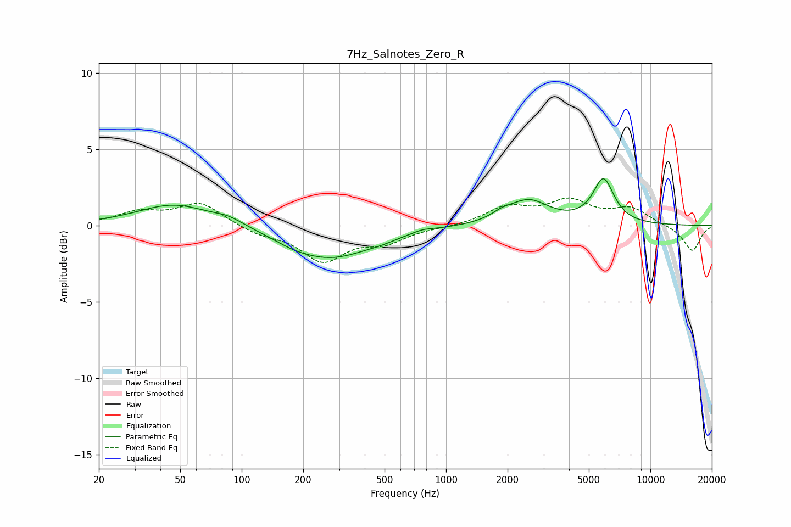

# 7Hz_Salnotes_Zero_R
See [usage instructions](https://github.com/jaakkopasanen/AutoEq#usage) for more options and info.

### Parametric EQs
Apply preamp of -3.2 dB when using parametric equalizer.

|   # | Type    |   Fc (Hz) |    Q |   Gain (dB) |
|-----|---------|-----------|------|-------------|
|   1 | Peaking |        47 | 0.79 |         1.4 |
|   2 | Peaking |        86 | 1.93 |         0.4 |
|   3 | Peaking |       177 | 1.76 |        -0.2 |
|   4 | Peaking |       269 | 0.7  |        -2.1 |
|   5 | Peaking |       486 | 1.89 |        -0.2 |
|   6 | Peaking |       770 | 3.02 |         0.2 |
|   7 | Peaking |      1874 | 2.9  |         0.3 |
|   8 | Peaking |      2531 | 1.4  |         1.6 |
|   9 | Peaking |      5388 | 4.34 |        -0.2 |
|  10 | Peaking |      5859 | 2.65 |         3   |

### Fixed Band EQs
When using fixed band (also called graphic) equalizer, apply preamp of **-1.9 dB** (if available) and set gains manually with these parameters.

|   # | Type    |   Fc (Hz) |    Q |   Gain (dB) |
|-----|---------|-----------|------|-------------|
|   1 | Peaking |        31 | 1.41 |         0.8 |
|   2 | Peaking |        62 | 1.41 |         1.5 |
|   3 | Peaking |       125 | 1.41 |        -0.5 |
|   4 | Peaking |       250 | 1.41 |        -2.2 |
|   5 | Peaking |       500 | 1.41 |        -1   |
|   6 | Peaking |      1000 | 1.41 |        -0.1 |
|   7 | Peaking |      2000 | 1.41 |         1.1 |
|   8 | Peaking |      4000 | 1.41 |         1.5 |
|   9 | Peaking |      8000 | 1.41 |         1.1 |
|  10 | Peaking |     16000 | 1.41 |        -1.7 |

### Graphs

