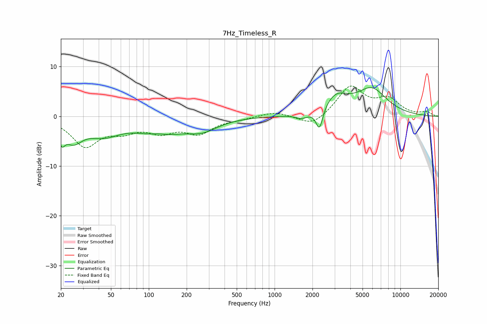

# 7Hz_Timeless_R
See [usage instructions](https://github.com/jaakkopasanen/AutoEq#usage) for more options and info.

### Parametric EQs
Apply preamp of -5.9 dB when using parametric equalizer.

|   # | Type    |   Fc (Hz) |    Q |   Gain (dB) |
|-----|---------|-----------|------|-------------|
|   1 | Peaking |        20 | 5.85 |        -2.9 |
|   2 | Peaking |        25 | 1.95 |        -4   |
|   3 | Peaking |        44 | 1.05 |        -3.2 |
|   4 | Peaking |       119 | 1.77 |         1.2 |
|   5 | Peaking |       121 | 0.92 |        -3.8 |
|   6 | Peaking |       265 | 1.11 |        -2.3 |
|   7 | Peaking |      1646 | 2.78 |        -1   |
|   8 | Peaking |      2271 | 5.08 |        -4.5 |
|   9 | Peaking |      3081 | 1.44 |         3.6 |
|  10 | Peaking |      5922 | 1.15 |         5.2 |

### Fixed Band EQs
When using fixed band (also called graphic) equalizer, apply preamp of **-6.2 dB** (if available) and set gains manually with these parameters.

|   # | Type    |   Fc (Hz) |    Q |   Gain (dB) |
|-----|---------|-----------|------|-------------|
|   1 | Peaking |        31 | 1.41 |        -5.7 |
|   2 | Peaking |        62 | 1.41 |        -2.3 |
|   3 | Peaking |       125 | 1.41 |        -2.7 |
|   4 | Peaking |       250 | 1.41 |        -3.1 |
|   5 | Peaking |       500 | 1.41 |        -0.4 |
|   6 | Peaking |      1000 | 1.41 |         1   |
|   7 | Peaking |      2000 | 1.41 |        -2.2 |
|   8 | Peaking |      4000 | 1.41 |         6   |
|   9 | Peaking |      8000 | 1.41 |         3.1 |
|  10 | Peaking |     16000 | 1.41 |         0.8 |

### Graphs

