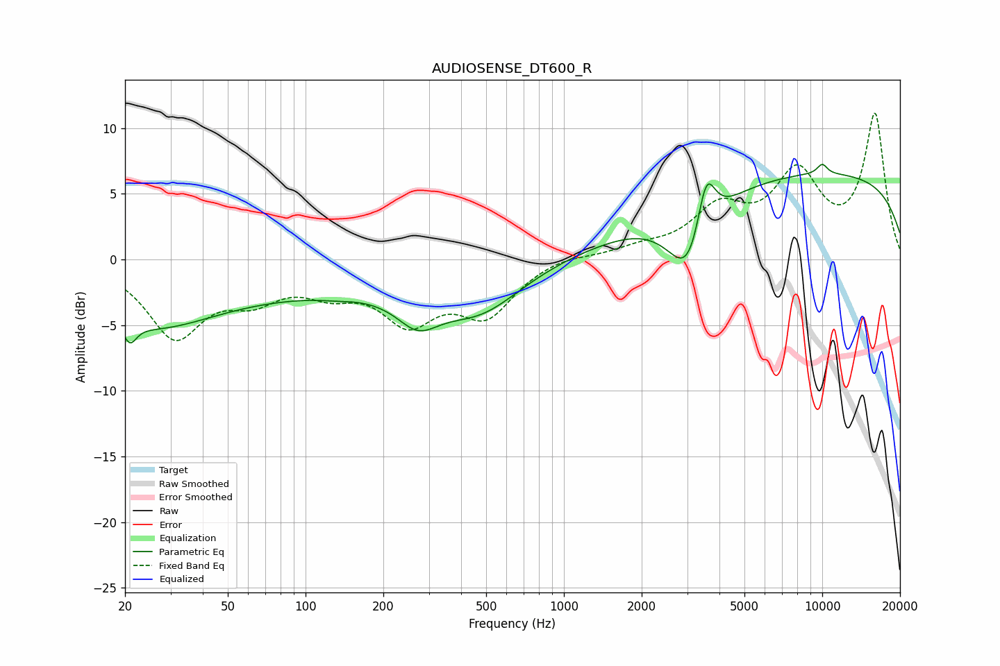

# AUDIOSENSE_DT600_R
See [usage instructions](https://github.com/jaakkopasanen/AutoEq#usage) for more options and info.

### Parametric EQs
Apply preamp of -7.3 dB when using parametric equalizer.

|   # | Type    |   Fc (Hz) |    Q |   Gain (dB) |
|-----|---------|-----------|------|-------------|
|   1 | Peaking |        21 | 5.66 |        -1.5 |
|   2 | Peaking |        24 | 0.59 |        -3.6 |
|   3 | Peaking |        84 | 0.21 |        -2.2 |
|   4 | Peaking |       130 | 2.18 |        -0.1 |
|   5 | Peaking |       272 | 1.73 |        -2.3 |
|   6 | Peaking |       476 | 0.88 |        -3.1 |
|   7 | Peaking |      3072 | 1.75 |        -6   |
|   8 | Peaking |      3550 | 3.84 |         5   |
|   9 | Peaking |      9326 | 0.18 |         6.6 |
|  10 | Peaking |     10000 | 6    |         0.8 |

### Fixed Band EQs
When using fixed band (also called graphic) equalizer, apply preamp of **-11.2 dB** (if available) and set gains manually with these parameters.

|   # | Type    |   Fc (Hz) |    Q |   Gain (dB) |
|-----|---------|-----------|------|-------------|
|   1 | Peaking |        31 | 1.41 |        -5.6 |
|   2 | Peaking |        62 | 1.41 |        -2.3 |
|   3 | Peaking |       125 | 1.41 |        -1.8 |
|   4 | Peaking |       250 | 1.41 |        -4.2 |
|   5 | Peaking |       500 | 1.41 |        -3.9 |
|   6 | Peaking |      1000 | 1.41 |         0.4 |
|   7 | Peaking |      2000 | 1.41 |         0.7 |
|   8 | Peaking |      4000 | 1.41 |         3.5 |
|   9 | Peaking |      8000 | 1.41 |         6   |
|  10 | Peaking |     16000 | 1.41 |        10.9 |

### Graphs

