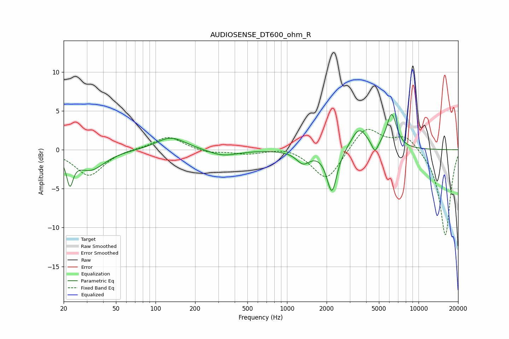

# AUDIOSENSE_DT600_ohm_R
See [usage instructions](https://github.com/jaakkopasanen/AutoEq#usage) for more options and info.

### Parametric EQs
Apply preamp of -4.6 dB when using parametric equalizer.

|   # | Type    |   Fc (Hz) |    Q |   Gain (dB) |
|-----|---------|-----------|------|-------------|
|   1 | Peaking |        22 | 5.9  |        -3.5 |
|   2 | Peaking |        32 | 1.33 |        -2.5 |
|   3 | Peaking |       129 | 1.33 |         1.4 |
|   4 | Peaking |       143 | 1.06 |         0.3 |
|   5 | Peaking |       325 | 1.25 |        -0.8 |
|   6 | Peaking |      1326 | 2.77 |        -1.6 |
|   7 | Peaking |      2195 | 3.71 |        -5.5 |
|   8 | Peaking |      3524 | 2.31 |         2.8 |
|   9 | Peaking |      4665 | 5.79 |        -1.5 |
|  10 | Peaking |      6252 | 3.62 |         4.4 |

### Fixed Band EQs
When using fixed band (also called graphic) equalizer, apply preamp of **-2.7 dB** (if available) and set gains manually with these parameters.

|   # | Type    |   Fc (Hz) |    Q |   Gain (dB) |
|-----|---------|-----------|------|-------------|
|   1 | Peaking |        31 | 1.41 |        -3.4 |
|   2 | Peaking |        62 | 1.41 |         0.1 |
|   3 | Peaking |       125 | 1.41 |         1.8 |
|   4 | Peaking |       250 | 1.41 |        -0.4 |
|   5 | Peaking |       500 | 1.41 |        -0.5 |
|   6 | Peaking |      1000 | 1.41 |         0.4 |
|   7 | Peaking |      2000 | 1.41 |        -4.1 |
|   8 | Peaking |      4000 | 1.41 |         3.1 |
|   9 | Peaking |      8000 | 1.41 |         1.9 |
|  10 | Peaking |     16000 | 1.41 |       -11.1 |

### Graphs

