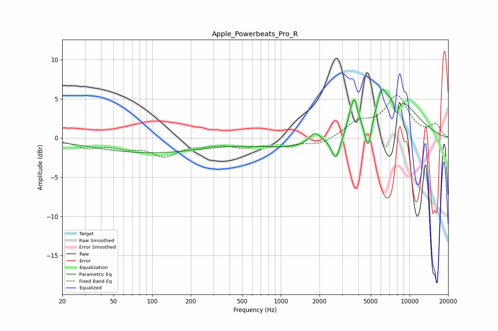

# Apple_Powerbeats_Pro_R
See [usage instructions](https://github.com/jaakkopasanen/AutoEq#usage) for more options and info.

### Parametric EQs
Apply preamp of -6.3 dB when using parametric equalizer.

|   # | Type    |   Fc (Hz) |    Q |   Gain (dB) |
|-----|---------|-----------|------|-------------|
|   1 | Peaking |        94 | 0.32 |        -1.8 |
|   2 | Peaking |      1396 | 0.45 |        -1.3 |
|   3 | Peaking |      1845 | 3.1  |         1.5 |
|   4 | Peaking |      2684 | 4.23 |        -3.1 |
|   5 | Peaking |      3449 | 6    |         0.9 |
|   6 | Peaking |      3722 | 5.65 |         3.4 |
|   7 | Peaking |      4778 | 5.11 |        -4.5 |
|   8 | Peaking |      6079 | 5.31 |         1.8 |
|   9 | Peaking |      7283 | 0.74 |         5.8 |
|  10 | Peaking |      7902 | 5.88 |        -2.3 |

### Fixed Band EQs
When using fixed band (also called graphic) equalizer, apply preamp of **-5.5 dB** (if available) and set gains manually with these parameters.

|   # | Type    |   Fc (Hz) |    Q |   Gain (dB) |
|-----|---------|-----------|------|-------------|
|   1 | Peaking |        31 | 1.41 |        -1.1 |
|   2 | Peaking |        62 | 1.41 |        -1   |
|   3 | Peaking |       125 | 1.41 |        -2.1 |
|   4 | Peaking |       250 | 1.41 |        -0.6 |
|   5 | Peaking |       500 | 1.41 |        -0.9 |
|   6 | Peaking |      1000 | 1.41 |        -0.9 |
|   7 | Peaking |      2000 | 1.41 |        -0.9 |
|   8 | Peaking |      4000 | 1.41 |         1.8 |
|   9 | Peaking |      8000 | 1.41 |         5.1 |
|  10 | Peaking |     16000 | 1.41 |         1.6 |

### Graphs

