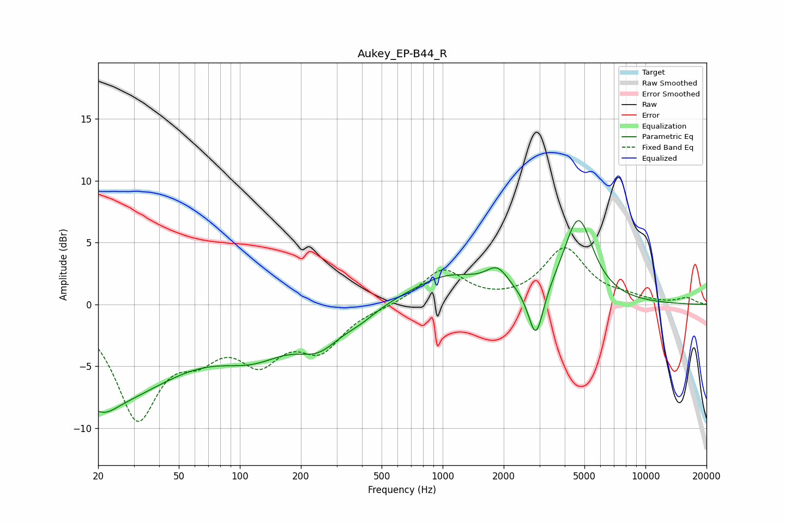

# Aukey_EP-B44_R
See [usage instructions](https://github.com/jaakkopasanen/AutoEq#usage) for more options and info.

### Parametric EQs
Apply preamp of -6.9 dB when using parametric equalizer.

|   # | Type    |   Fc (Hz) |    Q |   Gain (dB) |
|-----|---------|-----------|------|-------------|
|   1 | Peaking |        20 | 0.37 |        -7.8 |
|   2 | Peaking |        22 | 2.41 |        -0.8 |
|   3 | Peaking |       118 | 0.79 |        -2.9 |
|   4 | Peaking |       246 | 1.3  |        -2.4 |
|   5 | Peaking |       390 | 1.64 |        -0.7 |
|   6 | Peaking |       812 | 2.22 |        -0.1 |
|   7 | Peaking |      1053 | 0.77 |         2.3 |
|   8 | Peaking |      1864 | 2.52 |         1.7 |
|   9 | Peaking |      2883 | 3.8  |        -4.3 |
|  10 | Peaking |      4667 | 1.92 |         6.8 |

### Fixed Band EQs
When using fixed band (also called graphic) equalizer, apply preamp of **-4.7 dB** (if available) and set gains manually with these parameters.

|   # | Type    |   Fc (Hz) |    Q |   Gain (dB) |
|-----|---------|-----------|------|-------------|
|   1 | Peaking |        31 | 1.41 |        -8.8 |
|   2 | Peaking |        62 | 1.41 |        -2.8 |
|   3 | Peaking |       125 | 1.41 |        -3.8 |
|   4 | Peaking |       250 | 1.41 |        -3.2 |
|   5 | Peaking |       500 | 1.41 |        -0.2 |
|   6 | Peaking |      1000 | 1.41 |         2.8 |
|   7 | Peaking |      2000 | 1.41 |         0   |
|   8 | Peaking |      4000 | 1.41 |         4.4 |
|   9 | Peaking |      8000 | 1.41 |         0.4 |
|  10 | Peaking |     16000 | 1.41 |         0.5 |

### Graphs

