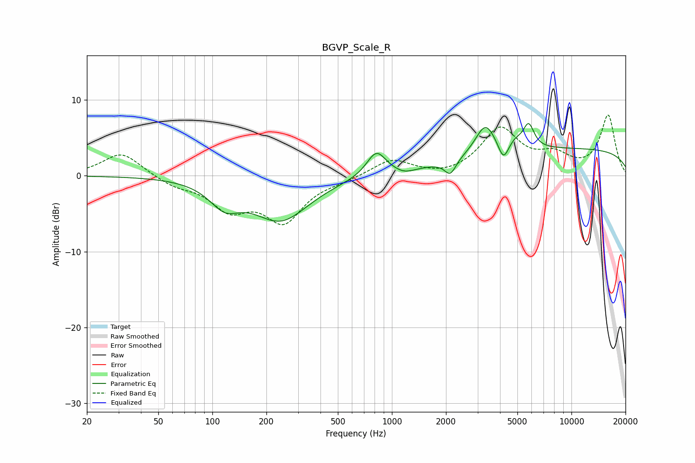

# BGVP_Scale_R
See [usage instructions](https://github.com/jaakkopasanen/AutoEq#usage) for more options and info.

### Parametric EQs
Apply preamp of -7.0 dB when using parametric equalizer.

|   # | Type    |   Fc (Hz) |    Q |   Gain (dB) |
|-----|---------|-----------|------|-------------|
|   1 | Peaking |       117 | 1.69 |        -2.9 |
|   2 | Peaking |       240 | 0.89 |        -5.7 |
|   3 | Peaking |       819 | 2.62 |         3.3 |
|   4 | Peaking |      1173 | 2.7  |        -0.6 |
|   5 | Peaking |      2115 | 4.48 |        -2   |
|   6 | Peaking |      3319 | 2.53 |         4.1 |
|   7 | Peaking |      4180 | 4.91 |        -2.4 |
|   8 | Peaking |      4869 | 3.66 |         1   |
|   9 | Peaking |      5774 | 4.59 |         3.1 |
|  10 | Peaking |     10000 | 0.18 |         3.5 |

### Fixed Band EQs
When using fixed band (also called graphic) equalizer, apply preamp of **-8.1 dB** (if available) and set gains manually with these parameters.

|   # | Type    |   Fc (Hz) |    Q |   Gain (dB) |
|-----|---------|-----------|------|-------------|
|   1 | Peaking |        31 | 1.41 |         3.1 |
|   2 | Peaking |        62 | 1.41 |        -1.2 |
|   3 | Peaking |       125 | 1.41 |        -4   |
|   4 | Peaking |       250 | 1.41 |        -5.7 |
|   5 | Peaking |       500 | 1.41 |        -0.5 |
|   6 | Peaking |      1000 | 1.41 |         2.2 |
|   7 | Peaking |      2000 | 1.41 |        -0.4 |
|   8 | Peaking |      4000 | 1.41 |         6   |
|   9 | Peaking |      8000 | 1.41 |         2.2 |
|  10 | Peaking |     16000 | 1.41 |         7.9 |

### Graphs

