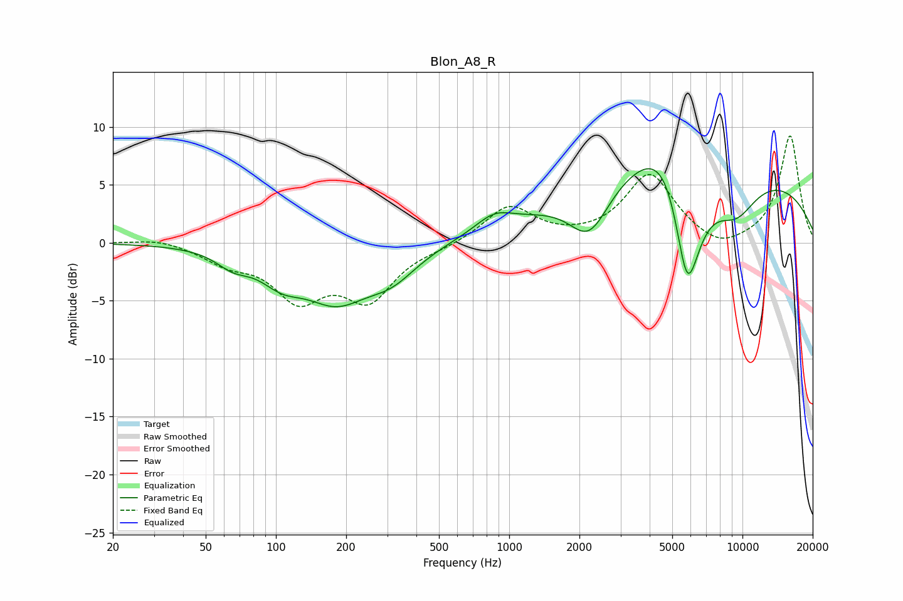

# Blon_A8_R
See [usage instructions](https://github.com/jaakkopasanen/AutoEq#usage) for more options and info.

### Parametric EQs
Apply preamp of -6.5 dB when using parametric equalizer.

|   # | Type    |   Fc (Hz) |    Q |   Gain (dB) |
|-----|---------|-----------|------|-------------|
|   1 | Peaking |        65 | 1.98 |        -1.2 |
|   2 | Peaking |       106 | 1.48 |        -2.2 |
|   3 | Peaking |       181 | 1.02 |        -4.3 |
|   4 | Peaking |       313 | 1.24 |        -2.3 |
|   5 | Peaking |       863 | 1.73 |         1.4 |
|   6 | Peaking |      2203 | 1.63 |        -4.3 |
|   7 | Peaking |      5010 | 0.97 |         9.4 |
|   8 | Peaking |      5784 | 1.72 |       -16.1 |
|   9 | Peaking |      7349 | 0.18 |         6.3 |
|  10 | Peaking |      9387 | 1.34 |        -3.2 |

### Fixed Band EQs
When using fixed band (also called graphic) equalizer, apply preamp of **-9.3 dB** (if available) and set gains manually with these parameters.

|   # | Type    |   Fc (Hz) |    Q |   Gain (dB) |
|-----|---------|-----------|------|-------------|
|   1 | Peaking |        31 | 1.41 |         0.5 |
|   2 | Peaking |        62 | 1.41 |        -1.4 |
|   3 | Peaking |       125 | 1.41 |        -4.4 |
|   4 | Peaking |       250 | 1.41 |        -4.5 |
|   5 | Peaking |       500 | 1.41 |        -0.3 |
|   6 | Peaking |      1000 | 1.41 |         3.2 |
|   7 | Peaking |      2000 | 1.41 |         0.1 |
|   8 | Peaking |      4000 | 1.41 |         5.8 |
|   9 | Peaking |      8000 | 1.41 |        -1   |
|  10 | Peaking |     16000 | 1.41 |         9.3 |

### Graphs

