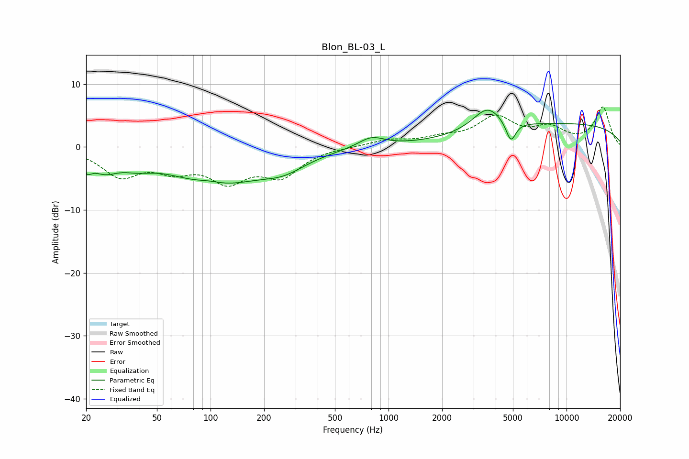

# Blon_BL-03_L
See [usage instructions](https://github.com/jaakkopasanen/AutoEq#usage) for more options and info.

### Parametric EQs
Apply preamp of -5.9 dB when using parametric equalizer.

|   # | Type    |   Fc (Hz) |    Q |   Gain (dB) |
|-----|---------|-----------|------|-------------|
|   1 | Peaking |        20 | 5.22 |        -1.8 |
|   2 | Peaking |        25 | 1.83 |        -2.6 |
|   3 | Peaking |        38 | 1.57 |        -1.3 |
|   4 | Peaking |        99 | 1.96 |         0.6 |
|   5 | Peaking |       108 | 0.54 |        -5.7 |
|   6 | Peaking |       258 | 1.15 |        -2   |
|   7 | Peaking |       800 | 1.9  |         1.7 |
|   8 | Peaking |      3592 | 1.74 |         3.7 |
|   9 | Peaking |      4869 | 5.06 |        -3.3 |
|  10 | Peaking |     10000 | 0.23 |         3.6 |

### Fixed Band EQs
When using fixed band (also called graphic) equalizer, apply preamp of **-6.4 dB** (if available) and set gains manually with these parameters.

|   # | Type    |   Fc (Hz) |    Q |   Gain (dB) |
|-----|---------|-----------|------|-------------|
|   1 | Peaking |        31 | 1.41 |        -4.3 |
|   2 | Peaking |        62 | 1.41 |        -2.9 |
|   3 | Peaking |       125 | 1.41 |        -4.8 |
|   4 | Peaking |       250 | 1.41 |        -4.2 |
|   5 | Peaking |       500 | 1.41 |         0   |
|   6 | Peaking |      1000 | 1.41 |         1   |
|   7 | Peaking |      2000 | 1.41 |         1.1 |
|   8 | Peaking |      4000 | 1.41 |         4.4 |
|   9 | Peaking |      8000 | 1.41 |         2.6 |
|  10 | Peaking |     16000 | 1.41 |         6.2 |

### Graphs

