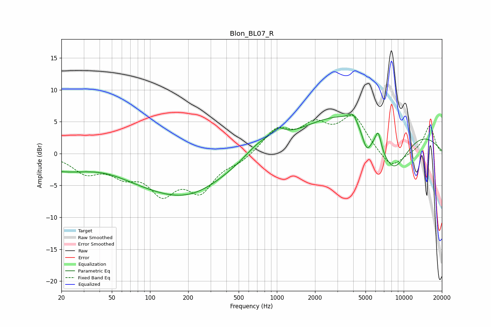

# Blon_BL07_R
See [usage instructions](https://github.com/jaakkopasanen/AutoEq#usage) for more options and info.

### Parametric EQs
Apply preamp of -6.3 dB when using parametric equalizer.

|   # | Type    |   Fc (Hz) |    Q |   Gain (dB) |
|-----|---------|-----------|------|-------------|
|   1 | Peaking |        42 | 0.63 |         2.2 |
|   2 | Peaking |        62 | 0.19 |        -4.9 |
|   3 | Peaking |       214 | 0.51 |        -3.1 |
|   4 | Peaking |       719 | 1.33 |         1.6 |
|   5 | Peaking |      1018 | 2.76 |         1.6 |
|   6 | Peaking |      3978 | 4.29 |         1.4 |
|   7 | Peaking |      5107 | 3.72 |        -3.2 |
|   8 | Peaking |      5992 | 0.27 |         9.3 |
|   9 | Peaking |      6289 | 6    |         2.7 |
|  10 | Peaking |      8190 | 0.84 |       -10.8 |

### Fixed Band EQs
When using fixed band (also called graphic) equalizer, apply preamp of **-6.1 dB** (if available) and set gains manually with these parameters.

|   # | Type    |   Fc (Hz) |    Q |   Gain (dB) |
|-----|---------|-----------|------|-------------|
|   1 | Peaking |        31 | 1.41 |        -2.7 |
|   2 | Peaking |        62 | 1.41 |        -2.7 |
|   3 | Peaking |       125 | 1.41 |        -5.5 |
|   4 | Peaking |       250 | 1.41 |        -5.3 |
|   5 | Peaking |       500 | 1.41 |        -1.1 |
|   6 | Peaking |      1000 | 1.41 |         3.6 |
|   7 | Peaking |      2000 | 1.41 |         3.8 |
|   8 | Peaking |      4000 | 1.41 |         5.5 |
|   9 | Peaking |      8000 | 1.41 |        -2.7 |
|  10 | Peaking |     16000 | 1.41 |         4.4 |

### Graphs

