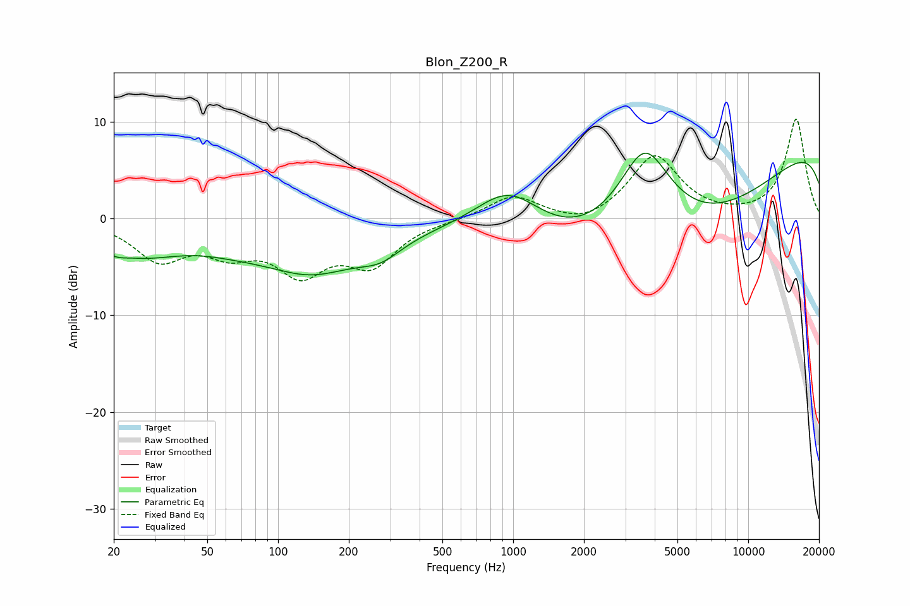

# Blon_Z200_R
See [usage instructions](https://github.com/jaakkopasanen/AutoEq#usage) for more options and info.

### Parametric EQs
Apply preamp of -6.9 dB when using parametric equalizer.

|   # | Type    |   Fc (Hz) |    Q |   Gain (dB) |
|-----|---------|-----------|------|-------------|
|   1 | Peaking |        20 | 3.47 |        -0.5 |
|   2 | Peaking |        25 | 0.71 |        -3.3 |
|   3 | Peaking |        63 | 0.96 |        -0.9 |
|   4 | Peaking |       107 | 2.15 |         0.1 |
|   5 | Peaking |       137 | 0.63 |        -5.1 |
|   6 | Peaking |       273 | 1.52 |        -1.7 |
|   7 | Peaking |       956 | 0.93 |         5.5 |
|   8 | Peaking |      3628 | 1.12 |        10.8 |
|   9 | Peaking |      4789 | 0.25 |       -14.1 |
|  10 | Peaking |     10000 | 0.18 |        12.3 |

### Fixed Band EQs
When using fixed band (also called graphic) equalizer, apply preamp of **-10.4 dB** (if available) and set gains manually with these parameters.

|   # | Type    |   Fc (Hz) |    Q |   Gain (dB) |
|-----|---------|-----------|------|-------------|
|   1 | Peaking |        31 | 1.41 |        -4   |
|   2 | Peaking |        62 | 1.41 |        -2.8 |
|   3 | Peaking |       125 | 1.41 |        -5   |
|   4 | Peaking |       250 | 1.41 |        -4.3 |
|   5 | Peaking |       500 | 1.41 |        -0.1 |
|   6 | Peaking |      1000 | 1.41 |         2.4 |
|   7 | Peaking |      2000 | 1.41 |        -1   |
|   8 | Peaking |      4000 | 1.41 |         6.5 |
|   9 | Peaking |      8000 | 1.41 |        -0   |
|  10 | Peaking |     16000 | 1.41 |        10.3 |

### Graphs

