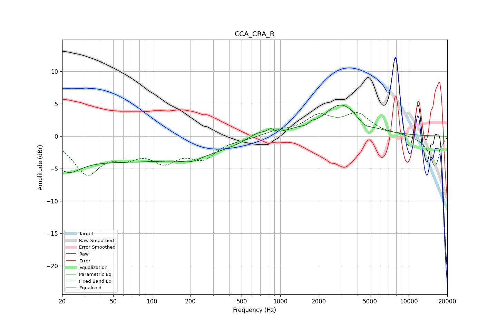

# CCA_CRA_R
See [usage instructions](https://github.com/jaakkopasanen/AutoEq#usage) for more options and info.

### Parametric EQs
Apply preamp of -4.9 dB when using parametric equalizer.

|   # | Type    |   Fc (Hz) |    Q |   Gain (dB) |
|-----|---------|-----------|------|-------------|
|   1 | Peaking |        22 | 1.4  |        -2.7 |
|   2 | Peaking |        76 | 0.18 |        -3.8 |
|   3 | Peaking |       202 | 1.94 |        -0.7 |
|   4 | Peaking |       673 | 1.68 |         1.2 |
|   5 | Peaking |       845 | 5.95 |         0.6 |
|   6 | Peaking |      1302 | 1.73 |         0.5 |
|   7 | Peaking |      1716 | 4.82 |        -1.5 |
|   8 | Peaking |      1732 | 5.52 |         1.8 |
|   9 | Peaking |      3002 | 1.01 |         5   |
|  10 | Peaking |      4507 | 2.63 |        -0.9 |

### Fixed Band EQs
When using fixed band (also called graphic) equalizer, apply preamp of **-3.8 dB** (if available) and set gains manually with these parameters.

|   # | Type    |   Fc (Hz) |    Q |   Gain (dB) |
|-----|---------|-----------|------|-------------|
|   1 | Peaking |        31 | 1.41 |        -5.5 |
|   2 | Peaking |        62 | 1.41 |        -2.3 |
|   3 | Peaking |       125 | 1.41 |        -3.3 |
|   4 | Peaking |       250 | 1.41 |        -3   |
|   5 | Peaking |       500 | 1.41 |        -0.3 |
|   6 | Peaking |      1000 | 1.41 |         0.7 |
|   7 | Peaking |      2000 | 1.41 |         2.8 |
|   8 | Peaking |      4000 | 1.41 |         3.1 |
|   9 | Peaking |      8000 | 1.41 |         0.2 |
|  10 | Peaking |     16000 | 1.41 |        -4.6 |

### Graphs

