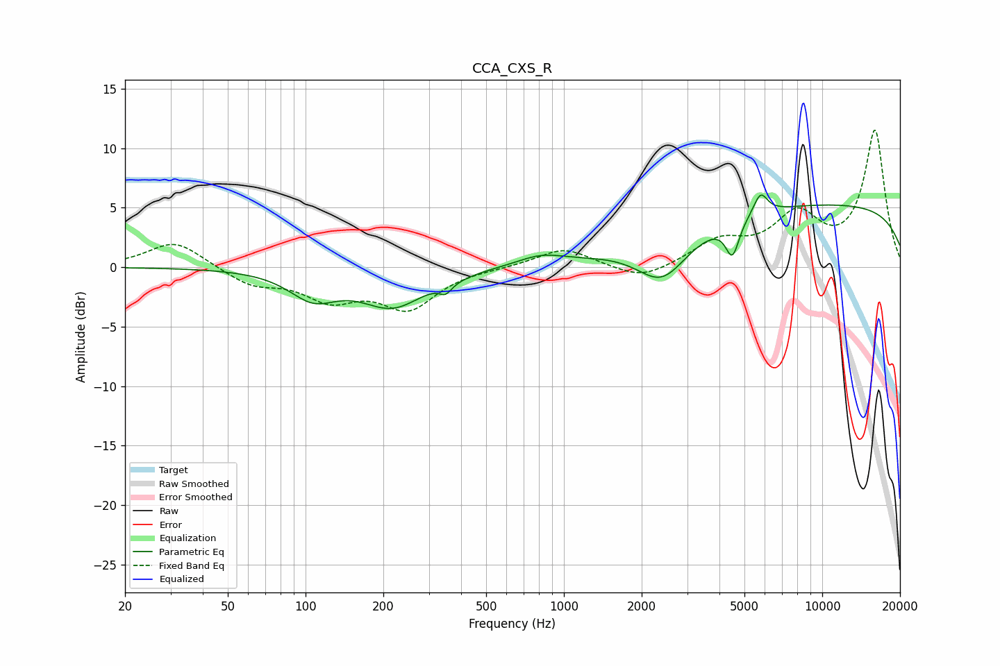

# CCA_CXS_R
See [usage instructions](https://github.com/jaakkopasanen/AutoEq#usage) for more options and info.

### Parametric EQs
Apply preamp of -6.1 dB when using parametric equalizer.

|   # | Type    |   Fc (Hz) |    Q |   Gain (dB) |
|-----|---------|-----------|------|-------------|
|   1 | Peaking |       107 | 1.53 |        -2.3 |
|   2 | Peaking |       217 | 1.15 |        -3.1 |
|   3 | Peaking |       348 | 5.91 |        -0.8 |
|   4 | Peaking |       383 | 1.83 |        -0.2 |
|   5 | Peaking |       813 | 1.59 |         0.8 |
|   6 | Peaking |      2404 | 1.42 |        -3.8 |
|   7 | Peaking |      4491 | 5.4  |        -2.9 |
|   8 | Peaking |      5705 | 4.36 |         0.4 |
|   9 | Peaking |      5779 | 5.32 |         1.5 |
|  10 | Peaking |     10000 | 0.18 |         5.3 |

### Fixed Band EQs
When using fixed band (also called graphic) equalizer, apply preamp of **-11.6 dB** (if available) and set gains manually with these parameters.

|   # | Type    |   Fc (Hz) |    Q |   Gain (dB) |
|-----|---------|-----------|------|-------------|
|   1 | Peaking |        31 | 1.41 |         2.3 |
|   2 | Peaking |        62 | 1.41 |        -1.4 |
|   3 | Peaking |       125 | 1.41 |        -2.4 |
|   4 | Peaking |       250 | 1.41 |        -3.3 |
|   5 | Peaking |       500 | 1.41 |        -0   |
|   6 | Peaking |      1000 | 1.41 |         1.6 |
|   7 | Peaking |      2000 | 1.41 |        -1.2 |
|   8 | Peaking |      4000 | 1.41 |         2   |
|   9 | Peaking |      8000 | 1.41 |         4   |
|  10 | Peaking |     16000 | 1.41 |        11.4 |

### Graphs

