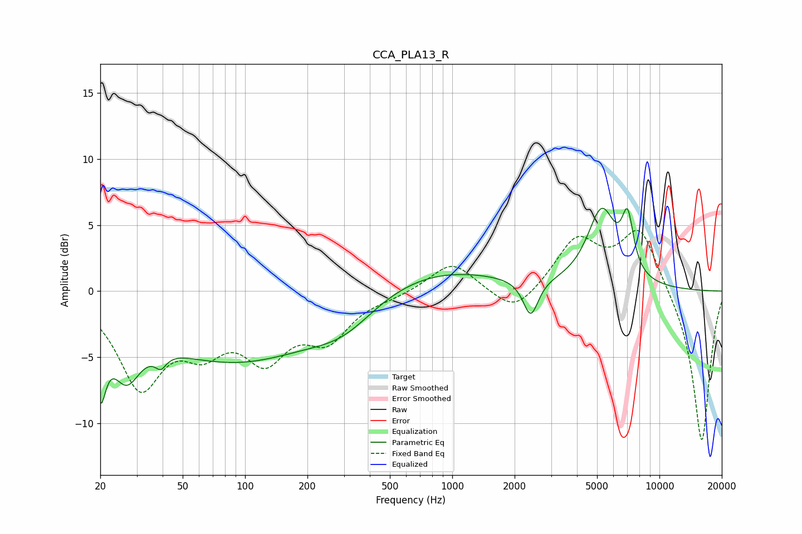

# CCA_PLA13_R
See [usage instructions](https://github.com/jaakkopasanen/AutoEq#usage) for more options and info.

### Parametric EQs
Apply preamp of -6.4 dB when using parametric equalizer.

|   # | Type    |   Fc (Hz) |    Q |   Gain (dB) |
|-----|---------|-----------|------|-------------|
|   1 | Peaking |        20 | 5.34 |        -5.1 |
|   2 | Peaking |        27 | 2.07 |        -4.1 |
|   3 | Peaking |        39 | 5.81 |         3   |
|   4 | Peaking |        39 | 5.63 |        -4.1 |
|   5 | Peaking |        89 | 0.34 |        -5.2 |
|   6 | Peaking |       302 | 0.88 |        -1.9 |
|   7 | Peaking |       752 | 0.41 |         1.9 |
|   8 | Peaking |      2392 | 3.91 |        -2.8 |
|   9 | Peaking |      5262 | 1.98 |         5.8 |
|  10 | Peaking |      7023 | 4.81 |         4   |

### Fixed Band EQs
When using fixed band (also called graphic) equalizer, apply preamp of **-4.7 dB** (if available) and set gains manually with these parameters.

|   # | Type    |   Fc (Hz) |    Q |   Gain (dB) |
|-----|---------|-----------|------|-------------|
|   1 | Peaking |        31 | 1.41 |        -6.8 |
|   2 | Peaking |        62 | 1.41 |        -3.3 |
|   3 | Peaking |       125 | 1.41 |        -4.4 |
|   4 | Peaking |       250 | 1.41 |        -3.2 |
|   5 | Peaking |       500 | 1.41 |        -0.3 |
|   6 | Peaking |      1000 | 1.41 |         2.3 |
|   7 | Peaking |      2000 | 1.41 |        -1.9 |
|   8 | Peaking |      4000 | 1.41 |         3.8 |
|   9 | Peaking |      8000 | 1.41 |         4.7 |
|  10 | Peaking |     16000 | 1.41 |       -11.6 |

### Graphs

