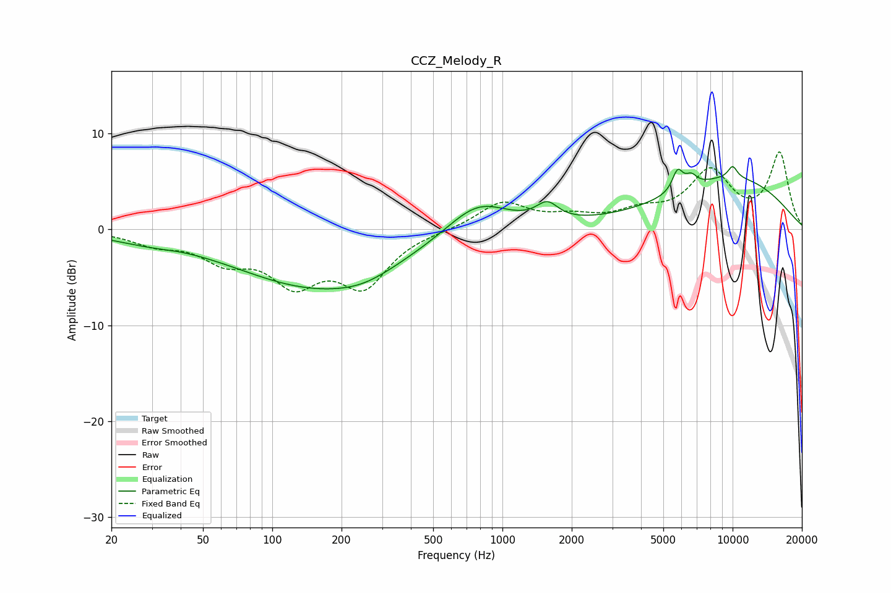

# CCZ_Melody_R
See [usage instructions](https://github.com/jaakkopasanen/AutoEq#usage) for more options and info.

### Parametric EQs
Apply preamp of -6.7 dB when using parametric equalizer.

|   # | Type    |   Fc (Hz) |    Q |   Gain (dB) |
|-----|---------|-----------|------|-------------|
|   1 | Peaking |        30 | 0.85 |        -0.9 |
|   2 | Peaking |        39 | 1.17 |         0.3 |
|   3 | Peaking |       157 | 0.39 |        -5.9 |
|   4 | Peaking |       250 | 1.1  |        -0.8 |
|   5 | Peaking |       781 | 1.04 |         3.5 |
|   6 | Peaking |      1566 | 3.01 |         1.8 |
|   7 | Peaking |      5770 | 6    |         2.2 |
|   8 | Peaking |      6607 | 5.37 |         1.1 |
|   9 | Peaking |     10000 | 0.42 |         5.3 |
|  10 | Peaking |     10000 | 6    |         1.3 |

### Fixed Band EQs
When using fixed band (also called graphic) equalizer, apply preamp of **-8.2 dB** (if available) and set gains manually with these parameters.

|   # | Type    |   Fc (Hz) |    Q |   Gain (dB) |
|-----|---------|-----------|------|-------------|
|   1 | Peaking |        31 | 1.41 |        -1.3 |
|   2 | Peaking |        62 | 1.41 |        -2.8 |
|   3 | Peaking |       125 | 1.41 |        -5   |
|   4 | Peaking |       250 | 1.41 |        -5.5 |
|   5 | Peaking |       500 | 1.41 |        -0   |
|   6 | Peaking |      1000 | 1.41 |         2.8 |
|   7 | Peaking |      2000 | 1.41 |         1   |
|   8 | Peaking |      4000 | 1.41 |         1.5 |
|   9 | Peaking |      8000 | 1.41 |         5.8 |
|  10 | Peaking |     16000 | 1.41 |         7.8 |

### Graphs

