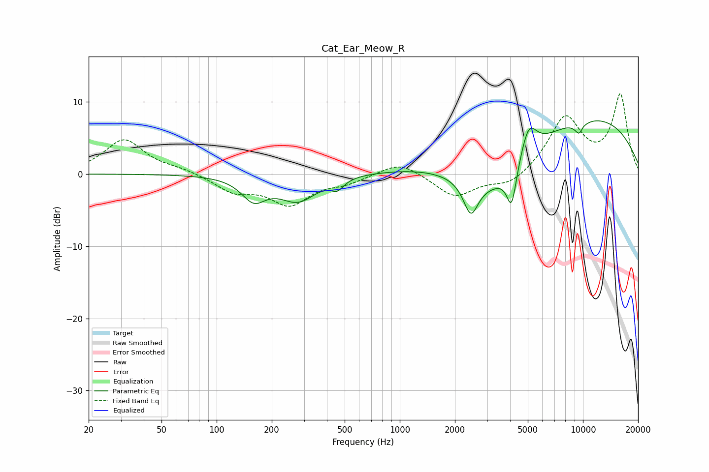

# Cat_Ear_Meow_R
See [usage instructions](https://github.com/jaakkopasanen/AutoEq#usage) for more options and info.

### Parametric EQs
Apply preamp of -7.5 dB when using parametric equalizer.

|   # | Type    |   Fc (Hz) |    Q |   Gain (dB) |
|-----|---------|-----------|------|-------------|
|   1 | Peaking |       159 | 2.14 |        -3.1 |
|   2 | Peaking |       278 | 1.38 |        -3.5 |
|   3 | Peaking |       456 | 4.12 |        -1.3 |
|   4 | Peaking |      2441 | 3.6  |        -4.6 |
|   5 | Peaking |      3354 | 0.6  |        -9   |
|   6 | Peaking |      4079 | 5.31 |        -5.4 |
|   7 | Peaking |      5052 | 3.14 |         4.5 |
|   8 | Peaking |      7347 | 0.21 |         9.7 |
|   9 | Peaking |      9674 | 4.78 |        -2.9 |
|  10 | Peaking |      9863 | 5.77 |         1.5 |

### Fixed Band EQs
When using fixed band (also called graphic) equalizer, apply preamp of **-11.2 dB** (if available) and set gains manually with these parameters.

|   # | Type    |   Fc (Hz) |    Q |   Gain (dB) |
|-----|---------|-----------|------|-------------|
|   1 | Peaking |        31 | 1.41 |         4.7 |
|   2 | Peaking |        62 | 1.41 |         0.6 |
|   3 | Peaking |       125 | 1.41 |        -2.3 |
|   4 | Peaking |       250 | 1.41 |        -4   |
|   5 | Peaking |       500 | 1.41 |        -1.1 |
|   6 | Peaking |      1000 | 1.41 |         1.9 |
|   7 | Peaking |      2000 | 1.41 |        -3.2 |
|   8 | Peaking |      4000 | 1.41 |        -1.7 |
|   9 | Peaking |      8000 | 1.41 |         7.7 |
|  10 | Peaking |     16000 | 1.41 |        10.8 |

### Graphs

