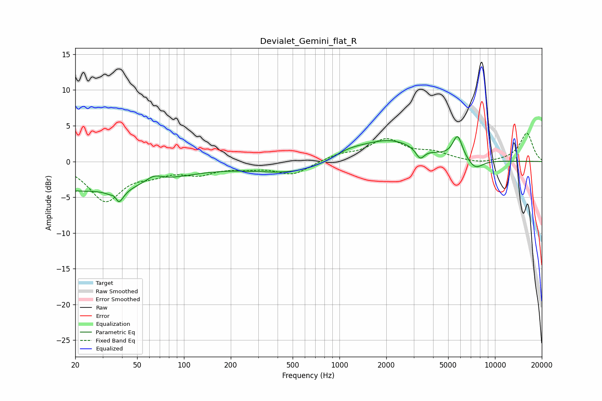

# Devialet_Gemini_flat_R
See [usage instructions](https://github.com/jaakkopasanen/AutoEq#usage) for more options and info.

### Parametric EQs
Apply preamp of -3.6 dB when using parametric equalizer.

|   # | Type    |   Fc (Hz) |    Q |   Gain (dB) |
|-----|---------|-----------|------|-------------|
|   1 | Peaking |        20 | 0.22 |        -4.1 |
|   2 | Peaking |        36 | 5.86 |         3.2 |
|   3 | Peaking |        37 | 4.63 |        -4.7 |
|   4 | Peaking |        64 | 2.74 |         1   |
|   5 | Peaking |       515 | 0.54 |        -1.7 |
|   6 | Peaking |      1136 | 1.28 |         1.1 |
|   7 | Peaking |      2092 | 0.74 |         3   |
|   8 | Peaking |      3300 | 5.17 |        -1.5 |
|   9 | Peaking |      5749 | 4.4  |         3.2 |
|  10 | Peaking |      7457 | 2.67 |        -1.4 |

### Fixed Band EQs
When using fixed band (also called graphic) equalizer, apply preamp of **-4.0 dB** (if available) and set gains manually with these parameters.

|   # | Type    |   Fc (Hz) |    Q |   Gain (dB) |
|-----|---------|-----------|------|-------------|
|   1 | Peaking |        31 | 1.41 |        -5.3 |
|   2 | Peaking |        62 | 1.41 |        -1.3 |
|   3 | Peaking |       125 | 1.41 |        -1.5 |
|   4 | Peaking |       250 | 1.41 |        -0.7 |
|   5 | Peaking |       500 | 1.41 |        -1.8 |
|   6 | Peaking |      1000 | 1.41 |         0.9 |
|   7 | Peaking |      2000 | 1.41 |         2.9 |
|   8 | Peaking |      4000 | 1.41 |         1.1 |
|   9 | Peaking |      8000 | 1.41 |        -0.4 |
|  10 | Peaking |     16000 | 1.41 |         4   |

### Graphs

