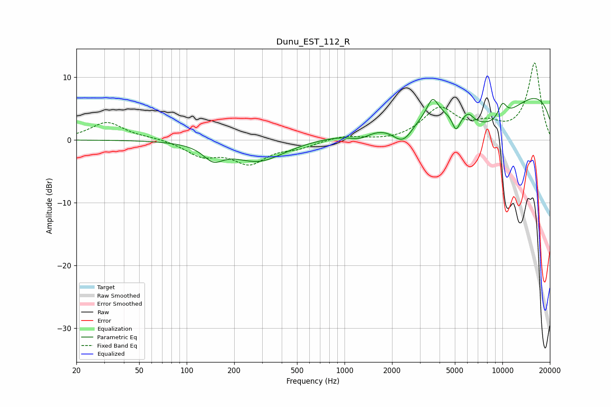

# Dunu_EST_112_R
See [usage instructions](https://github.com/jaakkopasanen/AutoEq#usage) for more options and info.

### Parametric EQs
Apply preamp of -6.7 dB when using parametric equalizer.

|   # | Type    |   Fc (Hz) |    Q |   Gain (dB) |
|-----|---------|-----------|------|-------------|
|   1 | Peaking |       147 | 2.26 |        -2.3 |
|   2 | Peaking |       286 | 0.89 |        -3.4 |
|   3 | Peaking |      1253 | 1.97 |        -1.2 |
|   4 | Peaking |      2350 | 1.99 |        -3.9 |
|   5 | Peaking |      3615 | 4.15 |         2.9 |
|   6 | Peaking |      5081 | 5.92 |        -2.5 |
|   7 | Peaking |      6092 | 4.65 |         1.2 |
|   8 | Peaking |      8248 | 0.6  |        -7.2 |
|   9 | Peaking |      9965 | 0.18 |         9.9 |
|  10 | Peaking |     10000 | 4.22 |         2.4 |

### Fixed Band EQs
When using fixed band (also called graphic) equalizer, apply preamp of **-12.3 dB** (if available) and set gains manually with these parameters.

|   # | Type    |   Fc (Hz) |    Q |   Gain (dB) |
|-----|---------|-----------|------|-------------|
|   1 | Peaking |        31 | 1.41 |         2.8 |
|   2 | Peaking |        62 | 1.41 |         0.3 |
|   3 | Peaking |       125 | 1.41 |        -2.3 |
|   4 | Peaking |       250 | 1.41 |        -3.5 |
|   5 | Peaking |       500 | 1.41 |        -1   |
|   6 | Peaking |      1000 | 1.41 |         0.7 |
|   7 | Peaking |      2000 | 1.41 |        -0.3 |
|   8 | Peaking |      4000 | 1.41 |         4.8 |
|   9 | Peaking |      8000 | 1.41 |         2   |
|  10 | Peaking |     16000 | 1.41 |        12.2 |

### Graphs

