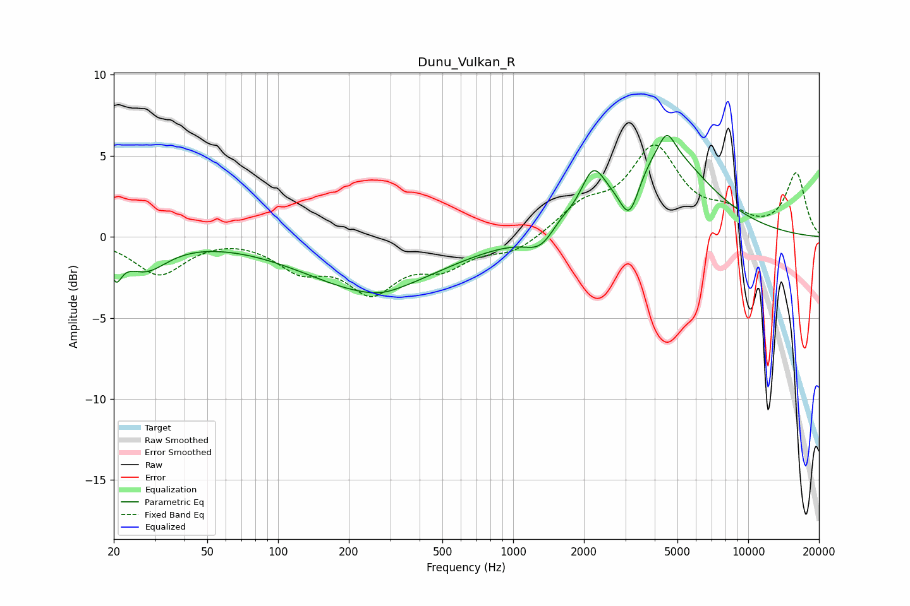

# Dunu_Vulkan_R
See [usage instructions](https://github.com/jaakkopasanen/AutoEq#usage) for more options and info.

### Parametric EQs
Apply preamp of -6.4 dB when using parametric equalizer.

|   # | Type    |   Fc (Hz) |    Q |   Gain (dB) |
|-----|---------|-----------|------|-------------|
|   1 | Peaking |        20 | 5.77 |        -1.6 |
|   2 | Peaking |        27 | 1.49 |        -1.9 |
|   3 | Peaking |       249 | 0.49 |        -3.2 |
|   4 | Peaking |       275 | 1.78 |        -0.2 |
|   5 | Peaking |      1304 | 2.2  |        -1.1 |
|   6 | Peaking |      1598 | 3.23 |         0.4 |
|   7 | Peaking |      2184 | 2.81 |         2.6 |
|   8 | Peaking |      3125 | 3.31 |        -2.7 |
|   9 | Peaking |      4386 | 0.77 |         5.2 |
|  10 | Peaking |      4508 | 4.19 |         1.3 |

### Fixed Band EQs
When using fixed band (also called graphic) equalizer, apply preamp of **-5.8 dB** (if available) and set gains manually with these parameters.

|   # | Type    |   Fc (Hz) |    Q |   Gain (dB) |
|-----|---------|-----------|------|-------------|
|   1 | Peaking |        31 | 1.41 |        -2.3 |
|   2 | Peaking |        62 | 1.41 |         0.1 |
|   3 | Peaking |       125 | 1.41 |        -1.8 |
|   4 | Peaking |       250 | 1.41 |        -3.1 |
|   5 | Peaking |       500 | 1.41 |        -1.6 |
|   6 | Peaking |      1000 | 1.41 |        -0.9 |
|   7 | Peaking |      2000 | 1.41 |         1.7 |
|   8 | Peaking |      4000 | 1.41 |         5.2 |
|   9 | Peaking |      8000 | 1.41 |         1.1 |
|  10 | Peaking |     16000 | 1.41 |         3.9 |

### Graphs

