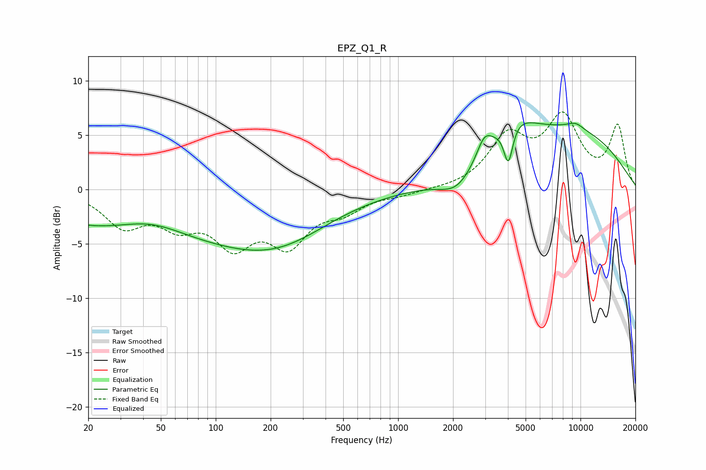

# EPZ_Q1_R
See [usage instructions](https://github.com/jaakkopasanen/AutoEq#usage) for more options and info.

### Parametric EQs
Apply preamp of -6.2 dB when using parametric equalizer.

|   # | Type    |   Fc (Hz) |    Q |   Gain (dB) |
|-----|---------|-----------|------|-------------|
|   1 | Peaking |        44 | 0.74 |         1.7 |
|   2 | Peaking |        57 | 0.18 |        -4.7 |
|   3 | Peaking |       230 | 0.54 |        -2.2 |
|   4 | Peaking |      2107 | 1.54 |        -1.8 |
|   5 | Peaking |      2964 | 3.55 |         1.6 |
|   6 | Peaking |      3741 | 1.86 |        -0.6 |
|   7 | Peaking |      4022 | 5.55 |        -3.7 |
|   8 | Peaking |      4050 | 1.12 |         3.8 |
|   9 | Peaking |      9036 | 0.37 |         5.1 |
|  10 | Peaking |      9384 | 2.85 |         0.5 |

### Fixed Band EQs
When using fixed band (also called graphic) equalizer, apply preamp of **-7.2 dB** (if available) and set gains manually with these parameters.

|   # | Type    |   Fc (Hz) |    Q |   Gain (dB) |
|-----|---------|-----------|------|-------------|
|   1 | Peaking |        31 | 1.41 |        -3.1 |
|   2 | Peaking |        62 | 1.41 |        -2.7 |
|   3 | Peaking |       125 | 1.41 |        -4.4 |
|   4 | Peaking |       250 | 1.41 |        -4.5 |
|   5 | Peaking |       500 | 1.41 |        -1.6 |
|   6 | Peaking |      1000 | 1.41 |        -0.4 |
|   7 | Peaking |      2000 | 1.41 |        -0   |
|   8 | Peaking |      4000 | 1.41 |         4.5 |
|   9 | Peaking |      8000 | 1.41 |         6.2 |
|  10 | Peaking |     16000 | 1.41 |         5.7 |

### Graphs

