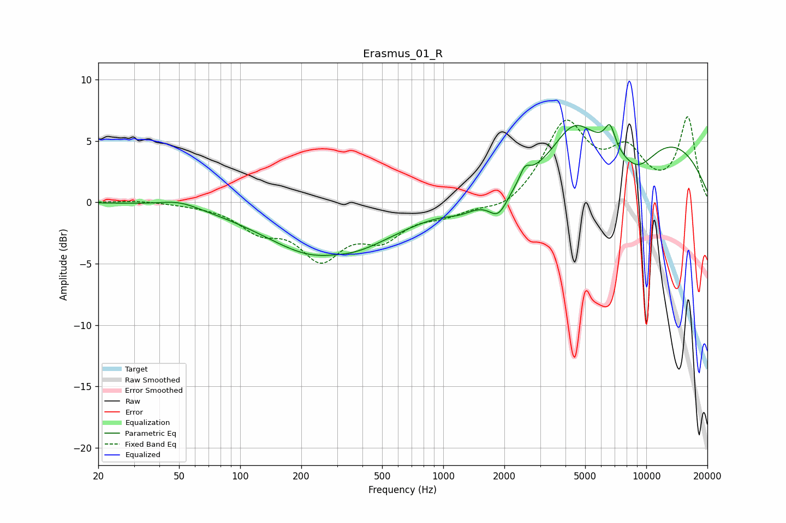

# Erasmus_01_R
See [usage instructions](https://github.com/jaakkopasanen/AutoEq#usage) for more options and info.

### Parametric EQs
Apply preamp of -6.4 dB when using parametric equalizer.

|   # | Type    |   Fc (Hz) |    Q |   Gain (dB) |
|-----|---------|-----------|------|-------------|
|   1 | Peaking |        50 | 1.48 |         0.5 |
|   2 | Peaking |       273 | 0.5  |        -4.8 |
|   3 | Peaking |       286 | 1.44 |         0.4 |
|   4 | Peaking |      1218 | 1.87 |        -0.6 |
|   5 | Peaking |      1870 | 2.97 |        -1.9 |
|   6 | Peaking |      2524 | 5.83 |         1   |
|   7 | Peaking |      4368 | 1.46 |         2.9 |
|   8 | Peaking |      6626 | 5.28 |         1.9 |
|   9 | Peaking |      8963 | 1.21 |        -3   |
|  10 | Peaking |     10000 | 0.3  |         5.7 |

### Fixed Band EQs
When using fixed band (also called graphic) equalizer, apply preamp of **-7.1 dB** (if available) and set gains manually with these parameters.

|   # | Type    |   Fc (Hz) |    Q |   Gain (dB) |
|-----|---------|-----------|------|-------------|
|   1 | Peaking |        31 | 1.41 |         0.2 |
|   2 | Peaking |        62 | 1.41 |        -0.1 |
|   3 | Peaking |       125 | 1.41 |        -1.9 |
|   4 | Peaking |       250 | 1.41 |        -4.1 |
|   5 | Peaking |       500 | 1.41 |        -2.5 |
|   6 | Peaking |      1000 | 1.41 |        -0.9 |
|   7 | Peaking |      2000 | 1.41 |        -0.9 |
|   8 | Peaking |      4000 | 1.41 |         6.3 |
|   9 | Peaking |      8000 | 1.41 |         3.6 |
|  10 | Peaking |     16000 | 1.41 |         6.8 |

### Graphs

