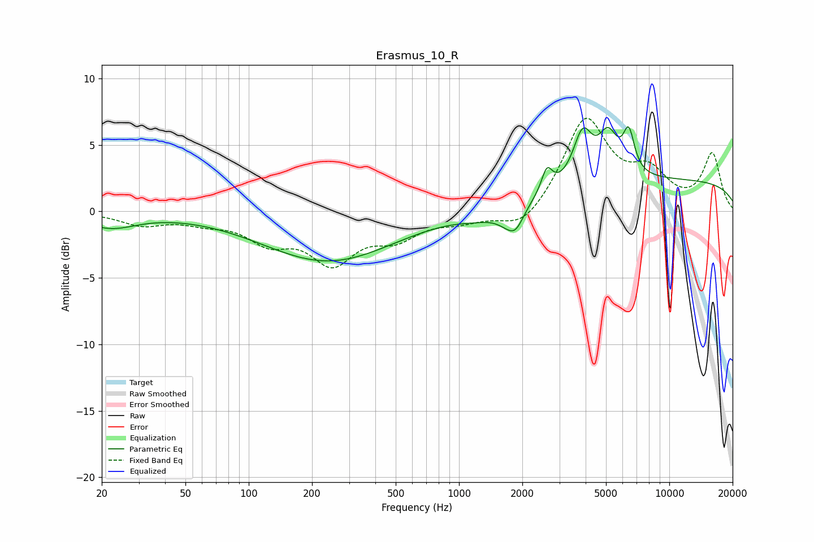

# Erasmus_10_R
See [usage instructions](https://github.com/jaakkopasanen/AutoEq#usage) for more options and info.

### Parametric EQs
Apply preamp of -6.5 dB when using parametric equalizer.

|   # | Type    |   Fc (Hz) |    Q |   Gain (dB) |
|-----|---------|-----------|------|-------------|
|   1 | Peaking |        22 | 1.14 |        -1.1 |
|   2 | Peaking |       238 | 0.45 |        -3.7 |
|   3 | Peaking |      1228 | 1.48 |        -0.5 |
|   4 | Peaking |      1761 | 2.39 |        -1.4 |
|   5 | Peaking |      1872 | 4.09 |        -0.8 |
|   6 | Peaking |      2617 | 5.51 |         1.8 |
|   7 | Peaking |      3873 | 3.11 |         3.7 |
|   8 | Peaking |      5117 | 3.03 |         3.1 |
|   9 | Peaking |      6416 | 5.07 |         3   |
|  10 | Peaking |     10000 | 0.18 |         2.3 |

### Fixed Band EQs
When using fixed band (also called graphic) equalizer, apply preamp of **-7.1 dB** (if available) and set gains manually with these parameters.

|   # | Type    |   Fc (Hz) |    Q |   Gain (dB) |
|-----|---------|-----------|------|-------------|
|   1 | Peaking |        31 | 1.41 |        -0.9 |
|   2 | Peaking |        62 | 1.41 |        -0.6 |
|   3 | Peaking |       125 | 1.41 |        -2   |
|   4 | Peaking |       250 | 1.41 |        -3.5 |
|   5 | Peaking |       500 | 1.41 |        -1.7 |
|   6 | Peaking |      1000 | 1.41 |        -0.6 |
|   7 | Peaking |      2000 | 1.41 |        -1.6 |
|   8 | Peaking |      4000 | 1.41 |         6.9 |
|   9 | Peaking |      8000 | 1.41 |         2.5 |
|  10 | Peaking |     16000 | 1.41 |         4.2 |

### Graphs

