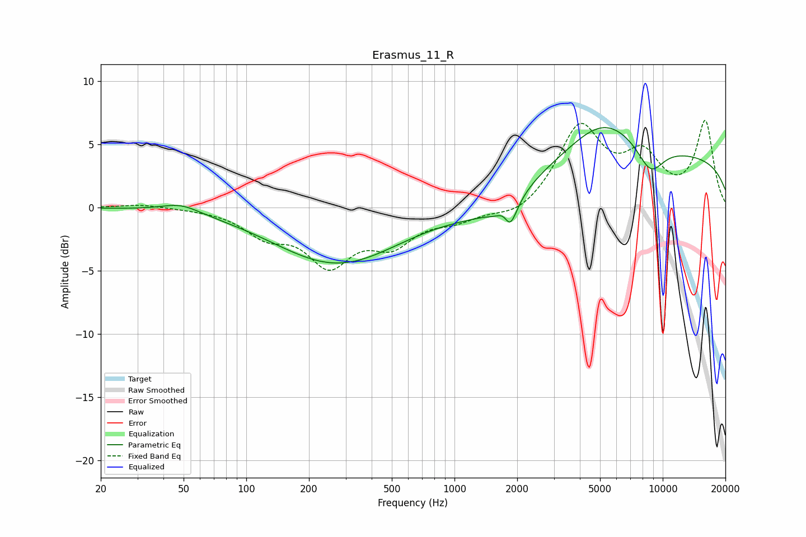

# Erasmus_11_R
See [usage instructions](https://github.com/jaakkopasanen/AutoEq#usage) for more options and info.

### Parametric EQs
Apply preamp of -6.4 dB when using parametric equalizer.

|   # | Type    |   Fc (Hz) |    Q |   Gain (dB) |
|-----|---------|-----------|------|-------------|
|   1 | Peaking |        48 | 1.55 |         0.7 |
|   2 | Peaking |       257 | 0.46 |        -0.4 |
|   3 | Peaking |       275 | 0.48 |        -4   |
|   4 | Peaking |      1354 | 0.88 |        -0.9 |
|   5 | Peaking |      1762 | 3.82 |         2.7 |
|   6 | Peaking |      1773 | 2.63 |        -2.7 |
|   7 | Peaking |      1834 | 4.79 |        -2.1 |
|   8 | Peaking |      5169 | 0.82 |         3.1 |
|   9 | Peaking |      8730 | 1.98 |        -2.4 |
|  10 | Peaking |     10000 | 0.18 |         4.1 |

### Fixed Band EQs
When using fixed band (also called graphic) equalizer, apply preamp of **-7.0 dB** (if available) and set gains manually with these parameters.

|   # | Type    |   Fc (Hz) |    Q |   Gain (dB) |
|-----|---------|-----------|------|-------------|
|   1 | Peaking |        31 | 1.41 |         0.3 |
|   2 | Peaking |        62 | 1.41 |        -0   |
|   3 | Peaking |       125 | 1.41 |        -1.9 |
|   4 | Peaking |       250 | 1.41 |        -4.1 |
|   5 | Peaking |       500 | 1.41 |        -2.5 |
|   6 | Peaking |      1000 | 1.41 |        -0.9 |
|   7 | Peaking |      2000 | 1.41 |        -0.9 |
|   8 | Peaking |      4000 | 1.41 |         6.3 |
|   9 | Peaking |      8000 | 1.41 |         3.6 |
|  10 | Peaking |     16000 | 1.41 |         6.7 |

### Graphs

