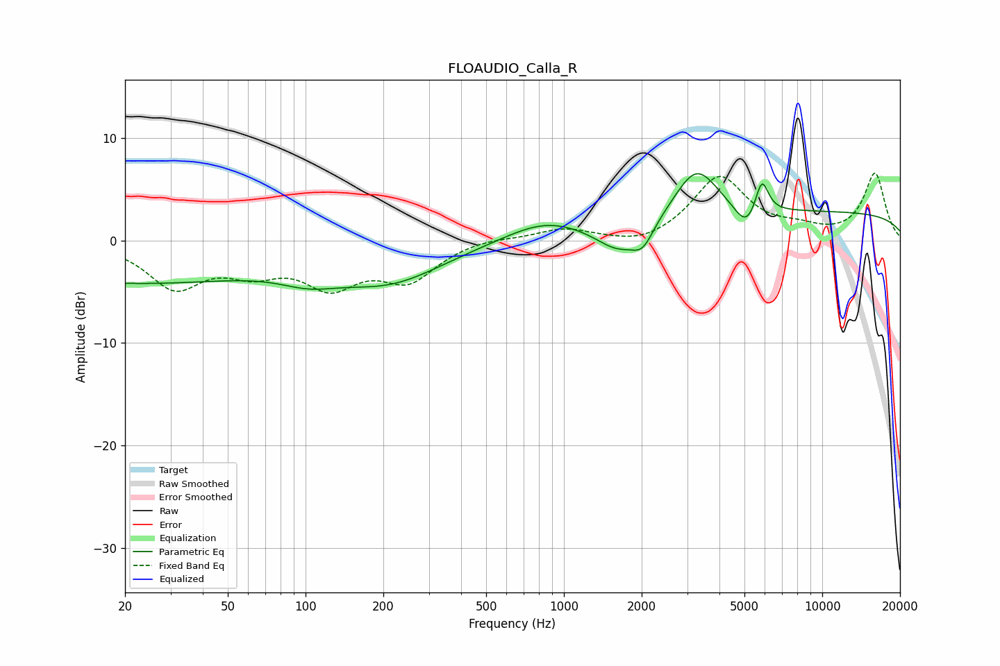

# FLOAUDIO_Calla_R
See [usage instructions](https://github.com/jaakkopasanen/AutoEq#usage) for more options and info.

### Parametric EQs
Apply preamp of -6.6 dB when using parametric equalizer.

|   # | Type    |   Fc (Hz) |    Q |   Gain (dB) |
|-----|---------|-----------|------|-------------|
|   1 | Peaking |        20 | 0.25 |        -4.1 |
|   2 | Peaking |       103 | 1.2  |        -1.4 |
|   3 | Peaking |       212 | 0.67 |        -3.6 |
|   4 | Peaking |       844 | 0.91 |         2   |
|   5 | Peaking |      1615 | 1.66 |        -2.4 |
|   6 | Peaking |      2020 | 3.29 |        -2.1 |
|   7 | Peaking |      3255 | 1.64 |         5.1 |
|   8 | Peaking |      5091 | 3.02 |        -2.4 |
|   9 | Peaking |      5835 | 5.42 |         3.4 |
|  10 | Peaking |     10000 | 0.18 |         2.7 |

### Fixed Band EQs
When using fixed band (also called graphic) equalizer, apply preamp of **-6.7 dB** (if available) and set gains manually with these parameters.

|   # | Type    |   Fc (Hz) |    Q |   Gain (dB) |
|-----|---------|-----------|------|-------------|
|   1 | Peaking |        31 | 1.41 |        -4.3 |
|   2 | Peaking |        62 | 1.41 |        -2.4 |
|   3 | Peaking |       125 | 1.41 |        -3.9 |
|   4 | Peaking |       250 | 1.41 |        -3.6 |
|   5 | Peaking |       500 | 1.41 |         0.4 |
|   6 | Peaking |      1000 | 1.41 |         1.1 |
|   7 | Peaking |      2000 | 1.41 |        -0.8 |
|   8 | Peaking |      4000 | 1.41 |         6.2 |
|   9 | Peaking |      8000 | 1.41 |         0.8 |
|  10 | Peaking |     16000 | 1.41 |         6.5 |

### Graphs

