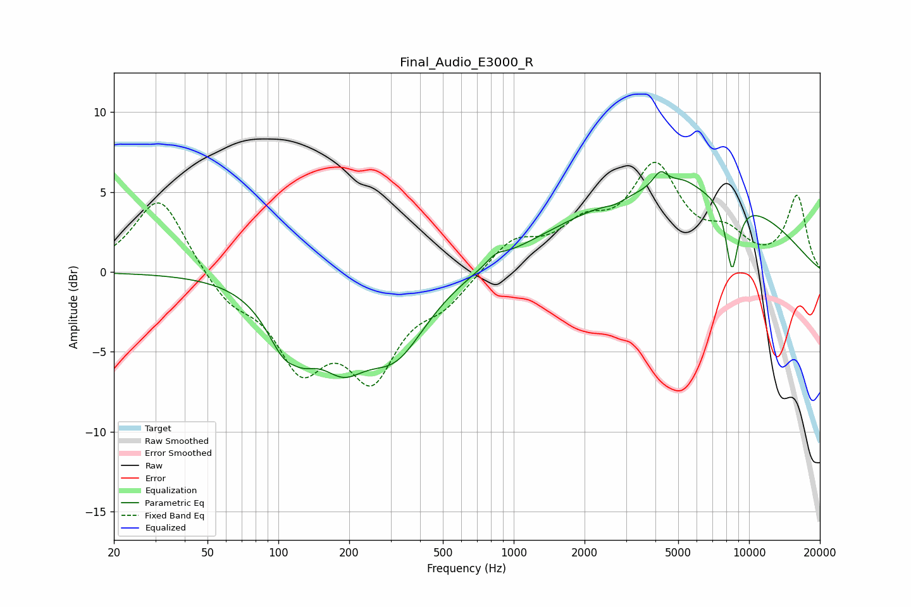

# Final_Audio_E3000_R
See [usage instructions](https://github.com/jaakkopasanen/AutoEq#usage) for more options and info.

### Parametric EQs
Apply preamp of -6.4 dB when using parametric equalizer.

|   # | Type    |   Fc (Hz) |    Q |   Gain (dB) |
|-----|---------|-----------|------|-------------|
|   1 | Peaking |       114 | 1.81 |        -6.7 |
|   2 | Peaking |       115 | 2.79 |         2.6 |
|   3 | Peaking |       188 | 1.41 |        -3.4 |
|   4 | Peaking |       314 | 1.04 |        -4.6 |
|   5 | Peaking |       839 | 3.58 |         0.5 |
|   6 | Peaking |      2698 | 3.28 |        -0.3 |
|   7 | Peaking |      4198 | 4.42 |         1   |
|   8 | Peaking |      5075 | 0.27 |         5.2 |
|   9 | Peaking |      5276 | 2.36 |         0.6 |
|  10 | Peaking |      8465 | 4.76 |        -4.4 |

### Fixed Band EQs
When using fixed band (also called graphic) equalizer, apply preamp of **-7.0 dB** (if available) and set gains manually with these parameters.

|   # | Type    |   Fc (Hz) |    Q |   Gain (dB) |
|-----|---------|-----------|------|-------------|
|   1 | Peaking |        31 | 1.41 |         4.9 |
|   2 | Peaking |        62 | 1.41 |        -1.7 |
|   3 | Peaking |       125 | 1.41 |        -5.3 |
|   4 | Peaking |       250 | 1.41 |        -5.9 |
|   5 | Peaking |       500 | 1.41 |        -1.7 |
|   6 | Peaking |      1000 | 1.41 |         1.9 |
|   7 | Peaking |      2000 | 1.41 |         2.3 |
|   8 | Peaking |      4000 | 1.41 |         6.1 |
|   9 | Peaking |      8000 | 1.41 |         1.8 |
|  10 | Peaking |     16000 | 1.41 |         4.7 |

### Graphs

