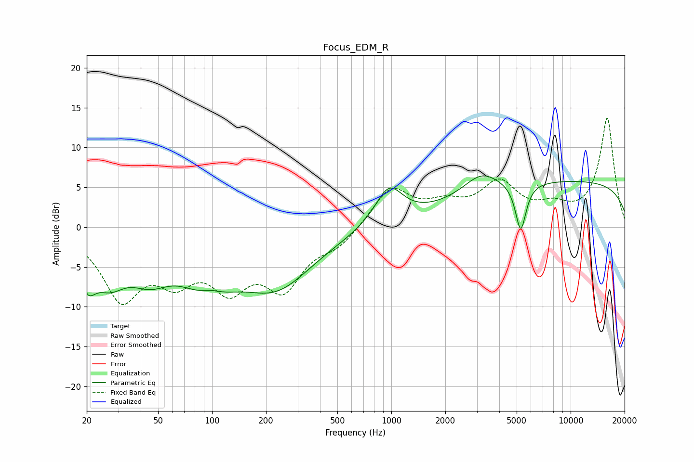

# Focus_EDM_R
See [usage instructions](https://github.com/jaakkopasanen/AutoEq#usage) for more options and info.

### Parametric EQs
Apply preamp of -6.5 dB when using parametric equalizer.

|   # | Type    |   Fc (Hz) |    Q |   Gain (dB) |
|-----|---------|-----------|------|-------------|
|   1 | Peaking |        20 | 3.06 |        -4.4 |
|   2 | Peaking |        27 | 1.5  |        -4.8 |
|   3 | Peaking |        45 | 1.17 |        -4.2 |
|   4 | Peaking |        95 | 1.15 |        -8.4 |
|   5 | Peaking |        96 | 1.77 |         4.1 |
|   6 | Peaking |       228 | 0.67 |        -6.9 |
|   7 | Peaking |       969 | 1.82 |         4.7 |
|   8 | Peaking |      3170 | 1.45 |         2.5 |
|   9 | Peaking |      5268 | 4.73 |        -6.1 |
|  10 | Peaking |     10000 | 0.18 |         5.7 |

### Fixed Band EQs
When using fixed band (also called graphic) equalizer, apply preamp of **-13.8 dB** (if available) and set gains manually with these parameters.

|   # | Type    |   Fc (Hz) |    Q |   Gain (dB) |
|-----|---------|-----------|------|-------------|
|   1 | Peaking |        31 | 1.41 |        -8.4 |
|   2 | Peaking |        62 | 1.41 |        -5.1 |
|   3 | Peaking |       125 | 1.41 |        -6.3 |
|   4 | Peaking |       250 | 1.41 |        -6.8 |
|   5 | Peaking |       500 | 1.41 |        -2   |
|   6 | Peaking |      1000 | 1.41 |         4.9 |
|   7 | Peaking |      2000 | 1.41 |         2.2 |
|   8 | Peaking |      4000 | 1.41 |         5.1 |
|   9 | Peaking |      8000 | 1.41 |         1.9 |
|  10 | Peaking |     16000 | 1.41 |        13.6 |

### Graphs

