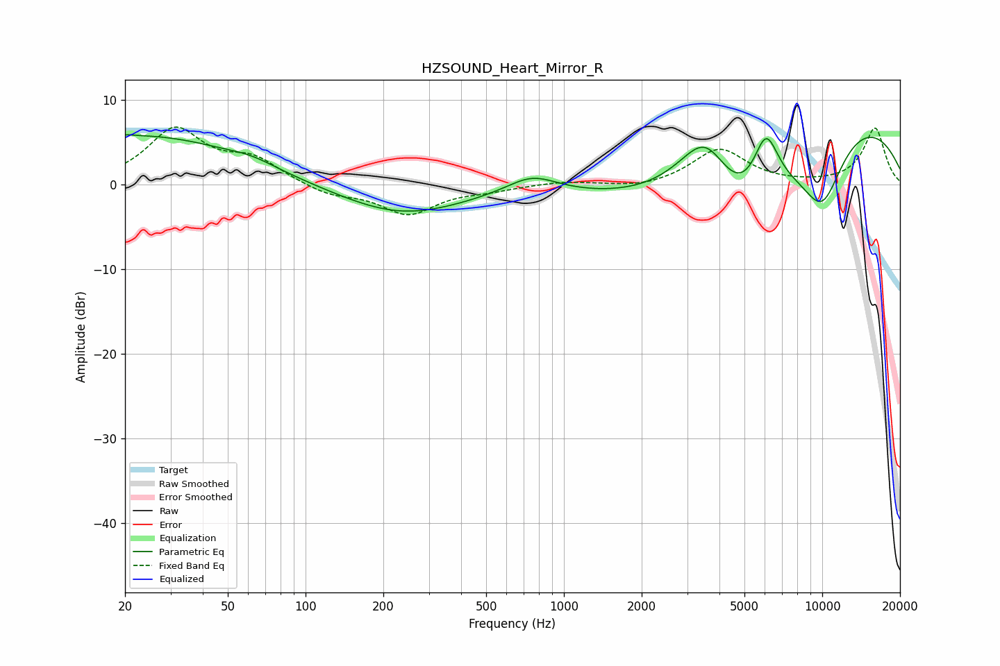

# HZSOUND_Heart_Mirror_R
See [usage instructions](https://github.com/jaakkopasanen/AutoEq#usage) for more options and info.

### Parametric EQs
Apply preamp of -6.0 dB when using parametric equalizer.

|   # | Type    |   Fc (Hz) |    Q |   Gain (dB) |
|-----|---------|-----------|------|-------------|
|   1 | Peaking |        20 | 4.83 |         0.2 |
|   2 | Peaking |        23 | 0.36 |         5.8 |
|   3 | Peaking |        62 | 1.6  |         0.7 |
|   4 | Peaking |       235 | 0.58 |        -3.6 |
|   5 | Peaking |       752 | 1.45 |         2.1 |
|   6 | Peaking |      3542 | 1.14 |        10.6 |
|   7 | Peaking |      4808 | 0.55 |       -15.2 |
|   8 | Peaking |      6053 | 2.63 |         7.3 |
|   9 | Peaking |      9921 | 0.3  |        11.8 |
|  10 | Peaking |     10000 | 1.4  |        -8.3 |

### Fixed Band EQs
When using fixed band (also called graphic) equalizer, apply preamp of **-6.9 dB** (if available) and set gains manually with these parameters.

|   # | Type    |   Fc (Hz) |    Q |   Gain (dB) |
|-----|---------|-----------|------|-------------|
|   1 | Peaking |        31 | 1.41 |         6.4 |
|   2 | Peaking |        62 | 1.41 |         2.7 |
|   3 | Peaking |       125 | 1.41 |        -1.2 |
|   4 | Peaking |       250 | 1.41 |        -3.4 |
|   5 | Peaking |       500 | 1.41 |        -0.5 |
|   6 | Peaking |      1000 | 1.41 |         0.4 |
|   7 | Peaking |      2000 | 1.41 |        -0.5 |
|   8 | Peaking |      4000 | 1.41 |         4.2 |
|   9 | Peaking |      8000 | 1.41 |        -0   |
|  10 | Peaking |     16000 | 1.41 |         6.7 |

### Graphs

