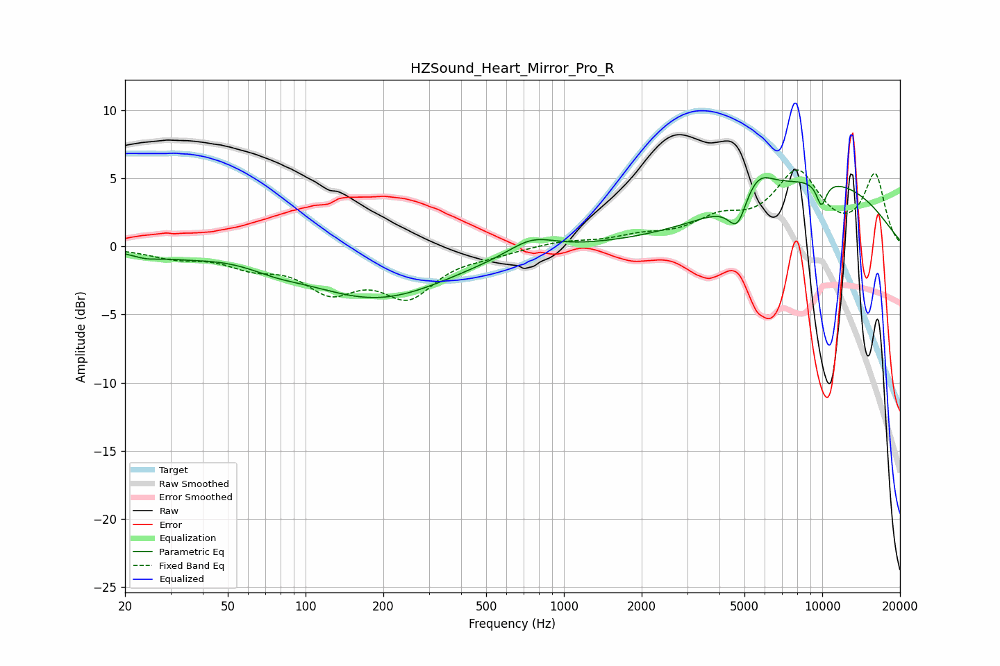

# HZSound_Heart_Mirror_Pro_R
See [usage instructions](https://github.com/jaakkopasanen/AutoEq#usage) for more options and info.

### Parametric EQs
Apply preamp of -5.2 dB when using parametric equalizer.

|   # | Type    |   Fc (Hz) |    Q |   Gain (dB) |
|-----|---------|-----------|------|-------------|
|   1 | Peaking |        24 | 2.3  |        -0.5 |
|   2 | Peaking |        34 | 1.45 |        -0.4 |
|   3 | Peaking |        77 | 1.45 |        -0.5 |
|   4 | Peaking |       189 | 0.5  |        -3.7 |
|   5 | Peaking |       750 | 1.58 |         1.1 |
|   6 | Peaking |      4696 | 3.9  |        -2.3 |
|   7 | Peaking |      5603 | 2.29 |         1.8 |
|   8 | Peaking |      9661 | 0.38 |         4.8 |
|   9 | Peaking |      9859 | 5.89 |        -0   |
|  10 | Peaking |      9929 | 6    |        -1.8 |

### Fixed Band EQs
When using fixed band (also called graphic) equalizer, apply preamp of **-5.7 dB** (if available) and set gains manually with these parameters.

|   # | Type    |   Fc (Hz) |    Q |   Gain (dB) |
|-----|---------|-----------|------|-------------|
|   1 | Peaking |        31 | 1.41 |        -0.7 |
|   2 | Peaking |        62 | 1.41 |        -1.2 |
|   3 | Peaking |       125 | 1.41 |        -2.8 |
|   4 | Peaking |       250 | 1.41 |        -3.3 |
|   5 | Peaking |       500 | 1.41 |        -0.4 |
|   6 | Peaking |      1000 | 1.41 |         0.4 |
|   7 | Peaking |      2000 | 1.41 |         0.6 |
|   8 | Peaking |      4000 | 1.41 |         1.7 |
|   9 | Peaking |      8000 | 1.41 |         5.1 |
|  10 | Peaking |     16000 | 1.41 |         5.1 |

### Graphs

