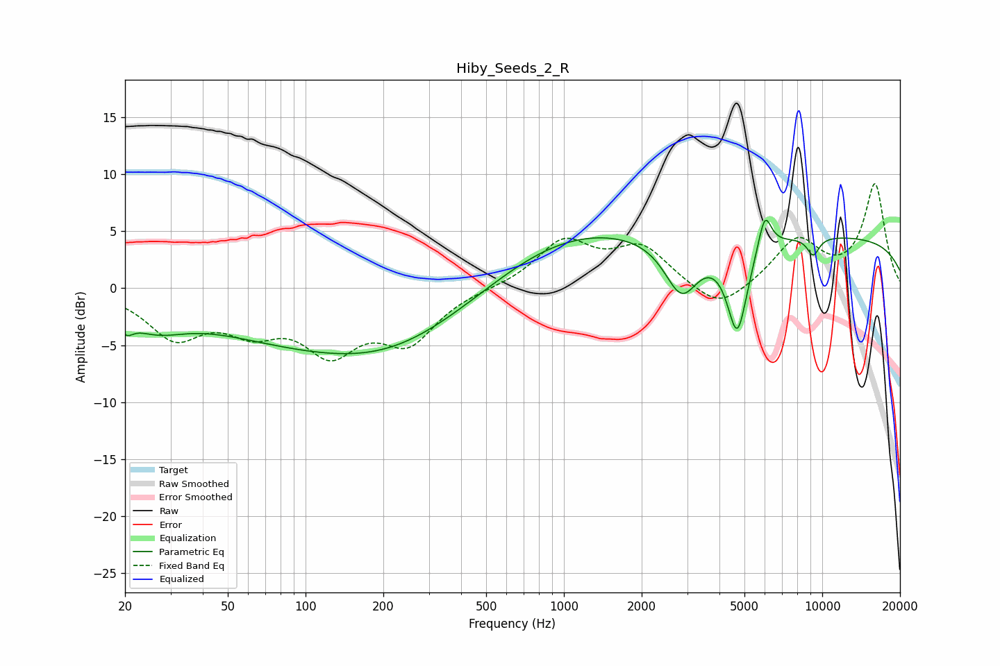

# Hiby_Seeds_2_R
See [usage instructions](https://github.com/jaakkopasanen/AutoEq#usage) for more options and info.

### Parametric EQs
Apply preamp of -6.0 dB when using parametric equalizer.

|   # | Type    |   Fc (Hz) |    Q |   Gain (dB) |
|-----|---------|-----------|------|-------------|
|   1 | Peaking |        20 | 5.24 |        -1.3 |
|   2 | Peaking |        26 | 1.2  |        -2.2 |
|   3 | Peaking |       148 | 0.26 |        -5.2 |
|   4 | Peaking |       212 | 0.57 |        -1.3 |
|   5 | Peaking |       994 | 0.42 |         4.8 |
|   6 | Peaking |      2852 | 2.13 |        -4.9 |
|   7 | Peaking |      4692 | 3.46 |        -8   |
|   8 | Peaking |      5990 | 5.33 |         3.3 |
|   9 | Peaking |      9226 | 5.34 |        -1.6 |
|  10 | Peaking |     10000 | 0.18 |         4.5 |

### Fixed Band EQs
When using fixed band (also called graphic) equalizer, apply preamp of **-9.2 dB** (if available) and set gains manually with these parameters.

|   # | Type    |   Fc (Hz) |    Q |   Gain (dB) |
|-----|---------|-----------|------|-------------|
|   1 | Peaking |        31 | 1.41 |        -4   |
|   2 | Peaking |        62 | 1.41 |        -2.9 |
|   3 | Peaking |       125 | 1.41 |        -4.9 |
|   4 | Peaking |       250 | 1.41 |        -4.3 |
|   5 | Peaking |       500 | 1.41 |        -0   |
|   6 | Peaking |      1000 | 1.41 |         4   |
|   7 | Peaking |      2000 | 1.41 |         3.4 |
|   8 | Peaking |      4000 | 1.41 |        -2.3 |
|   9 | Peaking |      8000 | 1.41 |         4.1 |
|  10 | Peaking |     16000 | 1.41 |         9   |

### Graphs

