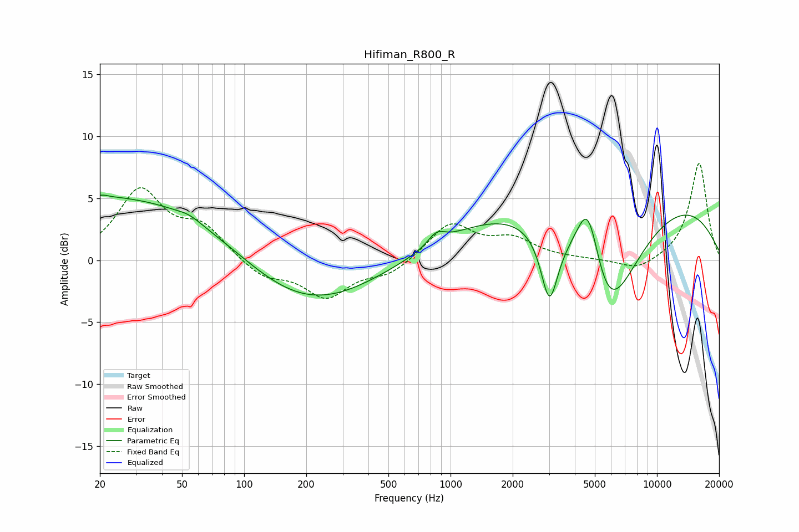

# Hifiman_R800_R
See [usage instructions](https://github.com/jaakkopasanen/AutoEq#usage) for more options and info.

### Parametric EQs
Apply preamp of -5.3 dB when using parametric equalizer.

|   # | Type    |   Fc (Hz) |    Q |   Gain (dB) |
|-----|---------|-----------|------|-------------|
|   1 | Peaking |        21 | 2.77 |         0.5 |
|   2 | Peaking |        22 | 4.68 |        -0.1 |
|   3 | Peaking |        30 | 0.26 |         5.3 |
|   4 | Peaking |        54 | 2.65 |         0.3 |
|   5 | Peaking |       188 | 0.43 |        -4.4 |
|   6 | Peaking |       854 | 3.43 |         1   |
|   7 | Peaking |      3013 | 3.42 |        -5.6 |
|   8 | Peaking |      4650 | 2.2  |         7.4 |
|   9 | Peaking |      5595 | 0.85 |       -12.2 |
|  10 | Peaking |      5887 | 0.18 |         7   |

### Fixed Band EQs
When using fixed band (also called graphic) equalizer, apply preamp of **-7.9 dB** (if available) and set gains manually with these parameters.

|   # | Type    |   Fc (Hz) |    Q |   Gain (dB) |
|-----|---------|-----------|------|-------------|
|   1 | Peaking |        31 | 1.41 |         5.5 |
|   2 | Peaking |        62 | 1.41 |         2.4 |
|   3 | Peaking |       125 | 1.41 |        -1.4 |
|   4 | Peaking |       250 | 1.41 |        -2.9 |
|   5 | Peaking |       500 | 1.41 |        -1.1 |
|   6 | Peaking |      1000 | 1.41 |         2.9 |
|   7 | Peaking |      2000 | 1.41 |         1.5 |
|   8 | Peaking |      4000 | 1.41 |         0   |
|   9 | Peaking |      8000 | 1.41 |        -0.9 |
|  10 | Peaking |     16000 | 1.41 |         7.9 |

### Graphs

