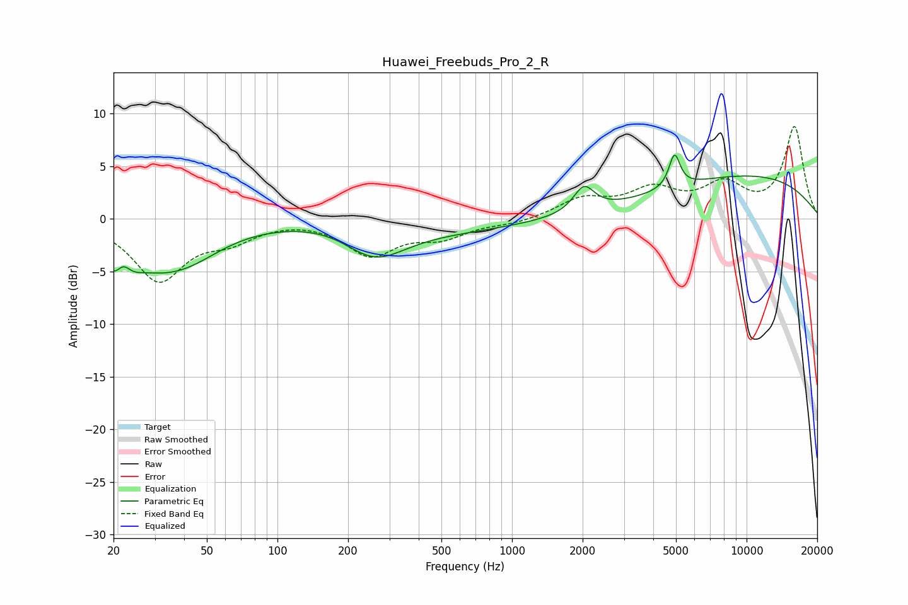

# Huawei_Freebuds_Pro_2_R
See [usage instructions](https://github.com/jaakkopasanen/AutoEq#usage) for more options and info.

### Parametric EQs
Apply preamp of -6.2 dB when using parametric equalizer.

|   # | Type    |   Fc (Hz) |    Q |   Gain (dB) |
|-----|---------|-----------|------|-------------|
|   1 | Peaking |        21 | 1.93 |        -4.8 |
|   2 | Peaking |        22 | 4.43 |         2.1 |
|   3 | Peaking |        32 | 1.49 |        -1   |
|   4 | Peaking |        40 | 0.88 |        -3.5 |
|   5 | Peaking |       185 | 0.8  |         0.7 |
|   6 | Peaking |       258 | 1.07 |        -3.3 |
|   7 | Peaking |       527 | 0.42 |        -1   |
|   8 | Peaking |      2026 | 3.17 |         2.4 |
|   9 | Peaking |      4930 | 6    |         3.1 |
|  10 | Peaking |     10000 | 0.31 |         4.1 |

### Fixed Band EQs
When using fixed band (also called graphic) equalizer, apply preamp of **-8.9 dB** (if available) and set gains manually with these parameters.

|   # | Type    |   Fc (Hz) |    Q |   Gain (dB) |
|-----|---------|-----------|------|-------------|
|   1 | Peaking |        31 | 1.41 |        -5.7 |
|   2 | Peaking |        62 | 1.41 |        -1.6 |
|   3 | Peaking |       125 | 1.41 |         0.1 |
|   4 | Peaking |       250 | 1.41 |        -3.3 |
|   5 | Peaking |       500 | 1.41 |        -1.5 |
|   6 | Peaking |      1000 | 1.41 |        -0.4 |
|   7 | Peaking |      2000 | 1.41 |         1.8 |
|   8 | Peaking |      4000 | 1.41 |         2.5 |
|   9 | Peaking |      8000 | 1.41 |         2.9 |
|  10 | Peaking |     16000 | 1.41 |         8.7 |

### Graphs

