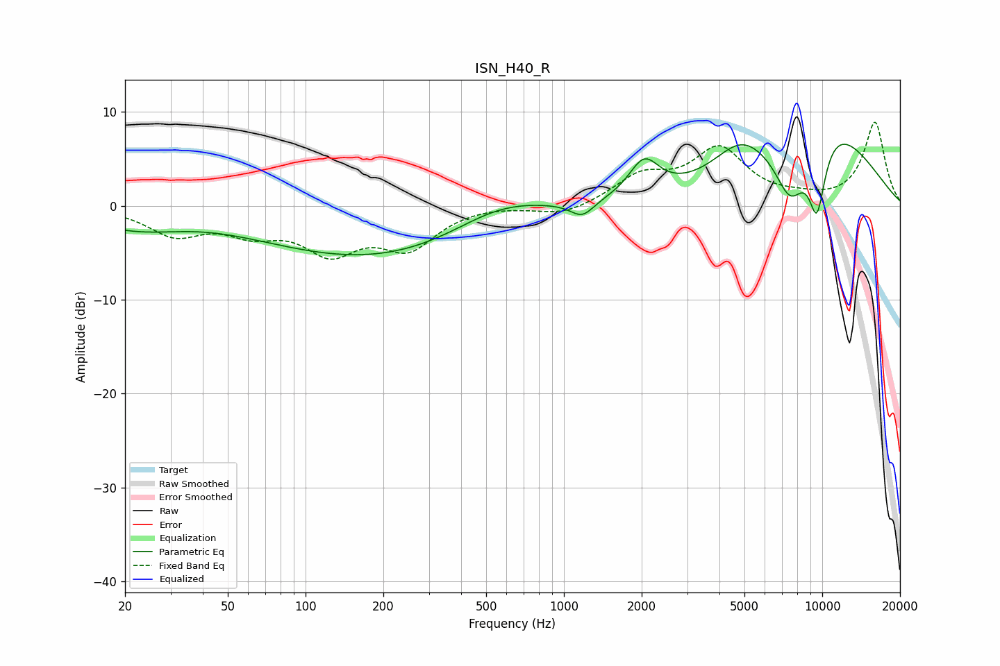

# ISN_H40_R
See [usage instructions](https://github.com/jaakkopasanen/AutoEq#usage) for more options and info.

### Parametric EQs
Apply preamp of -6.6 dB when using parametric equalizer.

|   # | Type    |   Fc (Hz) |    Q |   Gain (dB) |
|-----|---------|-----------|------|-------------|
|   1 | Peaking |        20 | 0.88 |        -1.7 |
|   2 | Peaking |        28 | 1.11 |        -0.4 |
|   3 | Peaking |       199 | 0.3  |        -5.8 |
|   4 | Peaking |       564 | 0.71 |         3.2 |
|   5 | Peaking |      1178 | 3.13 |        -1.6 |
|   6 | Peaking |      2044 | 2.4  |         3.9 |
|   7 | Peaking |      4816 | 1.32 |         3.5 |
|   8 | Peaking |      7528 | 2.11 |        -6.3 |
|   9 | Peaking |      9543 | 3.62 |        -7.9 |
|  10 | Peaking |     10000 | 0.54 |         9   |

### Fixed Band EQs
When using fixed band (also called graphic) equalizer, apply preamp of **-9.0 dB** (if available) and set gains manually with these parameters.

|   # | Type    |   Fc (Hz) |    Q |   Gain (dB) |
|-----|---------|-----------|------|-------------|
|   1 | Peaking |        31 | 1.41 |        -2.8 |
|   2 | Peaking |        62 | 1.41 |        -2.3 |
|   3 | Peaking |       125 | 1.41 |        -4.4 |
|   4 | Peaking |       250 | 1.41 |        -4.1 |
|   5 | Peaking |       500 | 1.41 |         0.2 |
|   6 | Peaking |      1000 | 1.41 |        -1.1 |
|   7 | Peaking |      2000 | 1.41 |         2.9 |
|   8 | Peaking |      4000 | 1.41 |         5.8 |
|   9 | Peaking |      8000 | 1.41 |         0.5 |
|  10 | Peaking |     16000 | 1.41 |         8.9 |

### Graphs

