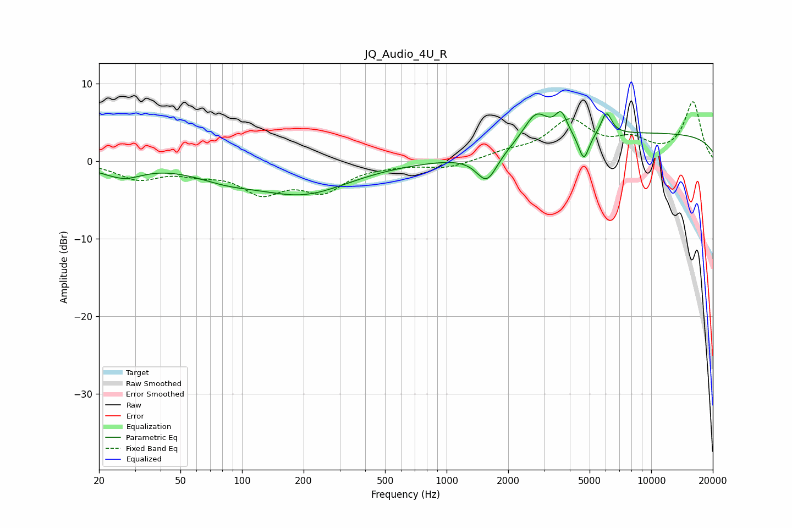

# JQ_Audio_4U_R
See [usage instructions](https://github.com/jaakkopasanen/AutoEq#usage) for more options and info.

### Parametric EQs
Apply preamp of -6.5 dB when using parametric equalizer.

|   # | Type    |   Fc (Hz) |    Q |   Gain (dB) |
|-----|---------|-----------|------|-------------|
|   1 | Peaking |        20 | 1.94 |        -0.4 |
|   2 | Peaking |        27 | 1.58 |        -1.7 |
|   3 | Peaking |        83 | 0.9  |        -1.5 |
|   4 | Peaking |       199 | 0.62 |        -4   |
|   5 | Peaking |      1572 | 2.73 |        -3.8 |
|   6 | Peaking |      2737 | 2.29 |         3.9 |
|   7 | Peaking |      3634 | 4.99 |         2.7 |
|   8 | Peaking |      4684 | 5.36 |        -3.5 |
|   9 | Peaking |      6038 | 5.29 |         2.9 |
|  10 | Peaking |     10000 | 0.18 |         3.6 |

### Fixed Band EQs
When using fixed band (also called graphic) equalizer, apply preamp of **-7.8 dB** (if available) and set gains manually with these parameters.

|   # | Type    |   Fc (Hz) |    Q |   Gain (dB) |
|-----|---------|-----------|------|-------------|
|   1 | Peaking |        31 | 1.41 |        -2.1 |
|   2 | Peaking |        62 | 1.41 |        -1.1 |
|   3 | Peaking |       125 | 1.41 |        -3.6 |
|   4 | Peaking |       250 | 1.41 |        -3.5 |
|   5 | Peaking |       500 | 1.41 |        -0.3 |
|   6 | Peaking |      1000 | 1.41 |        -0.9 |
|   7 | Peaking |      2000 | 1.41 |         0.9 |
|   8 | Peaking |      4000 | 1.41 |         5   |
|   9 | Peaking |      8000 | 1.41 |         2.3 |
|  10 | Peaking |     16000 | 1.41 |         7.5 |

### Graphs

