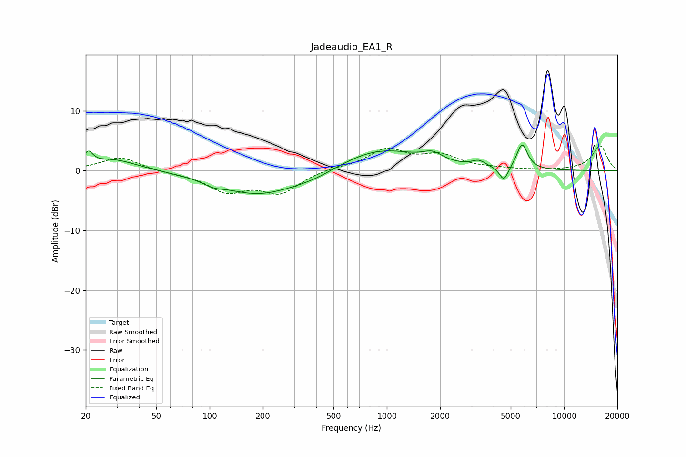

# Jadeaudio_EA1_R
See [usage instructions](https://github.com/jaakkopasanen/AutoEq#usage) for more options and info.

### Parametric EQs
Apply preamp of -4.4 dB when using parametric equalizer.

|   # | Type    |   Fc (Hz) |    Q |   Gain (dB) |
|-----|---------|-----------|------|-------------|
|   1 | Peaking |        21 | 5.78 |         2.1 |
|   2 | Peaking |        28 | 1.02 |         1.9 |
|   3 | Peaking |       105 | 2.72 |        -0.7 |
|   4 | Peaking |       189 | 0.64 |        -4   |
|   5 | Peaking |       388 | 1.11 |        -1   |
|   6 | Peaking |       910 | 0.62 |         3.7 |
|   7 | Peaking |      1813 | 2.57 |         1.4 |
|   8 | Peaking |      3304 | 3.63 |         1   |
|   9 | Peaking |      4574 | 5.53 |        -2.5 |
|  10 | Peaking |      5799 | 4.49 |         4.3 |

### Fixed Band EQs
When using fixed band (also called graphic) equalizer, apply preamp of **-4.2 dB** (if available) and set gains manually with these parameters.

|   # | Type    |   Fc (Hz) |    Q |   Gain (dB) |
|-----|---------|-----------|------|-------------|
|   1 | Peaking |        31 | 1.41 |         2.3 |
|   2 | Peaking |        62 | 1.41 |        -0.3 |
|   3 | Peaking |       125 | 1.41 |        -3.2 |
|   4 | Peaking |       250 | 1.41 |        -3.5 |
|   5 | Peaking |       500 | 1.41 |         0.4 |
|   6 | Peaking |      1000 | 1.41 |         3.4 |
|   7 | Peaking |      2000 | 1.41 |         2.3 |
|   8 | Peaking |      4000 | 1.41 |         0.3 |
|   9 | Peaking |      8000 | 1.41 |        -0   |
|  10 | Peaking |     16000 | 1.41 |         4.1 |

### Graphs

