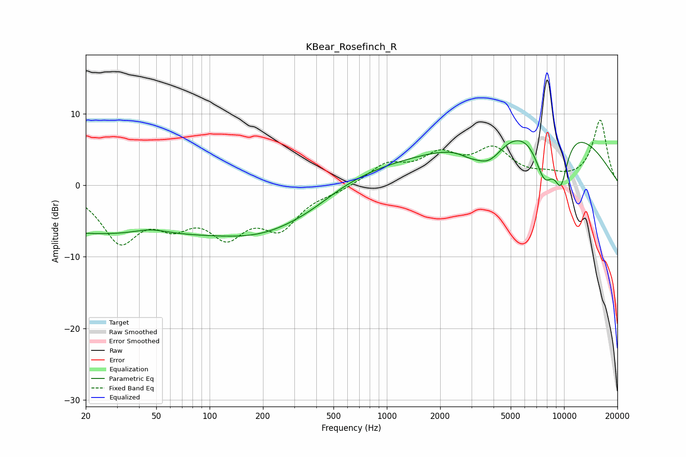

# KBear_Rosefinch_R
See [usage instructions](https://github.com/jaakkopasanen/AutoEq#usage) for more options and info.

### Parametric EQs
Apply preamp of -6.3 dB when using parametric equalizer.

|   # | Type    |   Fc (Hz) |    Q |   Gain (dB) |
|-----|---------|-----------|------|-------------|
|   1 | Peaking |        24 | 0.18 |        -6.7 |
|   2 | Peaking |        46 | 1.42 |         0.8 |
|   3 | Peaking |       217 | 0.5  |        -5.3 |
|   4 | Peaking |       378 | 0.93 |        -1   |
|   5 | Peaking |      1680 | 0.18 |         3.5 |
|   6 | Peaking |      2906 | 2.35 |        -0.8 |
|   7 | Peaking |      3762 | 1.61 |        -3.9 |
|   8 | Peaking |      7770 | 2.19 |        -7.2 |
|   9 | Peaking |      8385 | 0.35 |         8.3 |
|  10 | Peaking |      9609 | 3.13 |        -6.4 |

### Fixed Band EQs
When using fixed band (also called graphic) equalizer, apply preamp of **-9.2 dB** (if available) and set gains manually with these parameters.

|   # | Type    |   Fc (Hz) |    Q |   Gain (dB) |
|-----|---------|-----------|------|-------------|
|   1 | Peaking |        31 | 1.41 |        -7.3 |
|   2 | Peaking |        62 | 1.41 |        -4.1 |
|   3 | Peaking |       125 | 1.41 |        -5.9 |
|   4 | Peaking |       250 | 1.41 |        -5.3 |
|   5 | Peaking |       500 | 1.41 |        -0.7 |
|   6 | Peaking |      1000 | 1.41 |         2.7 |
|   7 | Peaking |      2000 | 1.41 |         3.7 |
|   8 | Peaking |      4000 | 1.41 |         4.5 |
|   9 | Peaking |      8000 | 1.41 |         0.9 |
|  10 | Peaking |     16000 | 1.41 |         9.1 |

### Graphs

